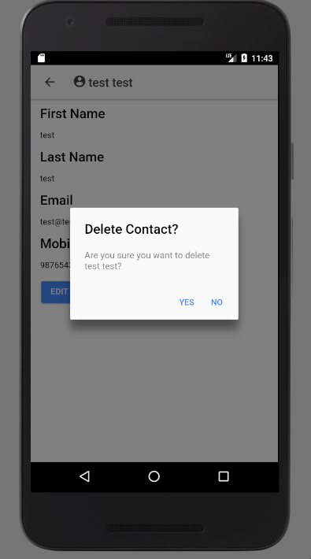
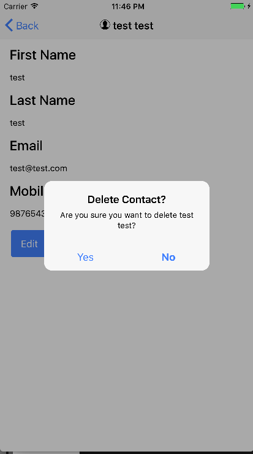

Since we can now [create Contacts](https://wipdeveloper.wpcomstaging.com/2017/08/09/salesforce-mobile-sdk-ionic-create-object-part-ii/) and [do it in style](https://wipdeveloper.wpcomstaging.com/2017/08/15/salesforce-mobile-sdk-ionic-styling-forms/) we may want to add in the ability to delete them as well.

## Update Contacts Service

Like all our interactions with Salesforce we will need to update our Contacts Service to provide the bridge between our app and the Salesforce allowing us to perform the action we are needing.  In this case, since we want to delete a Contact, we will have to make the call with `forcejs` to the DataService to `del` a `contact` object of the specified `Id`.

#### `deleteContact` Method

deleteContact(Id: string) {
  let oauth = OAuth.createInstance();

  return oauth.login()
    .then(oauthResult => {
      let service = DataService.createInstance(oauthResult);

      return service.del('Contact', Id);
    });
}

> I used the ES6 version of ForceJS for the delete method since it worked and required less typing for handling the callback but I am ready to switch it out with the ES5 version if there are any issues.

## Update Contact Details

Now we just need to decided where the delete button should be.  I'm going to put it on the Contact Details page so that users will have to navigate to the contact before attempting to delete it.

I'm going to add a `Delete` button on `contact-details.html` just after the `Edit` button.  I'll give it a color of `danger` so it stands out as a warning and have the click handler call a method named `deleteContact` that passes in no paramters.

#### `Delete` Button

<button ion-button color="danger" (click)="deleteContact()">Delete</button>

With the button in place we should create that method that it's going to call.

In your `contact-details.ts` file let's add a method named `deleteContact` that has no parameters.

Now we are going to use a [confirmation alert](http://ionicframework.com/docs/components/#alert-confirm) to verify the user meant to press `Delete` so we will need to add `AlertController` as an import from `ionic-angular`.

#### Updated Import

import { IonicPage, NavController, NavParams, ModalController, AlertController } from 'ionic-angular';

And the `AlertController` will need to be a parameter of the constructor.

#### Updated Constructor

constructor(
  public navCtrl: NavController,
  public navParams: NavParams,
  public modalCtrl: ModalController,
  private service: ContactsServiceProvider,
  public alertCtrl: AlertController
) { }

Now with an reference of the `AlertController` available we can use it to create andd display our confirmation pop up.

To do that we will use the `this.alertCtrl.create` method to create an alert.  This method takes an object as an argument so we will use that object to provide a `title`, `message`, and the `buttons`.  The `title` and `message` are both strings but I'll be a little fancy and use a template literal so that I can place the `this.contact.Name` in the `message` without using concatenation.

The `buttons` will be an array of objects, each representing a button.   Those objects will have a `text` property for the words that we want to display, and a `handler` for what we want to have happen when the button is used.

#### `deleteContact` Method

deleteContact() {
  let confirmDelete = this.alertCtrl.create({
    title: \`Delete Contact?\`,
    message: \`Are you sure you want to delete ${this.contact.Name}?\`,
    buttons: \[
      {
        text: 'Yes',
        handler: () => {
          this.service.deleteContact(this.contact.Id)
            .then(() => {

              confirmDelete.dismiss();
            })
        }
      },
      {
        text: 'No',
        handler: () => {
          confirmDelete.dismiss();
        }
      }
    \]
  });
  confirmDelete.present();
}

If you look closely you will see that both handlers call dismiss on the `confirmDelete` object.  The main difference is that for the `Yes` button it's in the promise resolution of the call to `service.deleteContact`.

Of course the last thing the `deleteContact` method does is `present` the alert.

#### Show the Alert - Android

#### Show the Alert - iOS

## Conclusion

With this done we don’t have to be sooo ashamed of how our edit-contact modal appears.

Don’t forget to sign up for [**The Weekly Stand-Up!**](https://wipdeveloper.wpcomstaging.com/newsletter/) to receive free the [WIP Developer.com](https://wipdeveloper.wpcomstaging.com/) weekly newsletter every Sunday!

Looking for the code and want to follow along?  Find it on [GitHub.com/BrettMN/salesforce-sdk-mobile-with-ionic-starter](https://github.com/BrettMN/salesforce-sdk-mobile-with-ionic-starter)
