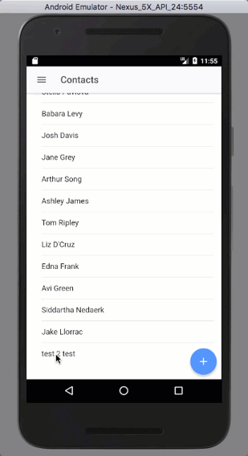
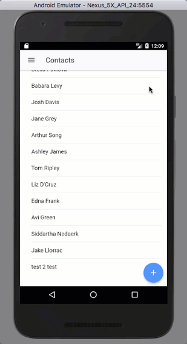

You may have seen some issues when we edit or create contacts and then use the back button and it takes us through the views that we had previously.  And sometimes that makes sense but when we close the Edit Contact modal pressing back should probably not re-open the modal.  Lets take a crack at fixing that.

## What's the Problem?

Originally, when a save was successful we `push()` a new instance of the `ContactDetailsPage` view on to the `navCtrl`.  This would cause a new instance to be created so now there are 2 instances of the `ContactDetailsPage` in the view stack separated by an instance of the modal we created with the `ContactEditPage` view.

This is the reason when using the back button on android we would go from the `contact-details` view to the `contact-edit` modal to the `contact-details` page, again, before being able to back to the contacts page.

#### Before

#### 

So now we know what the problem is you may be wondering how to fix it.  Lets figure that out.

## Updating `contact-edit.ts`

To correct this issue we will make an adjustment to the `ContactEditPage` class in `contact-edit.ts`.  The area that needs adjusting is in the `saveContact` method.

We will remove the `this.navCtrl.push(ContactDetailsPage, { "id": this.contact.Id });` line and replace it with a `this.viewCtrl.dismiss();`.  This means we wont need to import the `ContactDetailsPage` and we probably don't need the `NavController` either so let's remove that import too.  This means we will have to remove the`NavController` from the constructor as well.

The whole class will end up looking like this:

#### Updating `contact-edit.ts`

import { Component } from '@angular/core';
import { IonicPage, NavParams, ViewController } from 'ionic-angular';

import { ContactsServiceProvider } from '../../providers/contacts-service/contacts-service';

@IonicPage()
@Component({
  selector: 'page-contact-edit',
  templateUrl: 'contact-edit.html',
})
export class ContactEditPage {

  contact: any;

  constructor(
    public navParams: NavParams,
    public viewCtrl: ViewController,
    private service: ContactsServiceProvider
  ) { }

  ionViewDidLoad() {
    console.log('ionViewDidLoad ContactEditPage');

    this.contact = this.navParams.get('contact') || {};
  }

  saveContact() {
    this.service.saveContact(this.contact)
      .then(results => {
        console.log('updateContact was a success');
        console.log(results);

        this.viewCtrl.dismiss();
      })
      .catch(error => {
        console.log('updateContact had an error');
        console.log(error);
      })
  }

  dismiss() {
    this.viewCtrl.dismiss();
  }

}

With those changes in place we should get something that works a little better.

#### After

So that looks better.

## Why

You may be wondering why I pushed a new instance on the navigation stack when first creating this part of the app.  Well I thought it would be the best way to get the most recent copy of a contact to display.  It turns out though that if you just successfully saved or updated a contact you probably have the most recent data on hand.

So it was probably an unnecessary call to Salesforce and made the navigation not work properly.

## Conclusion

Don’t forget to sign up for [**The Weekly Stand-Up!**](https://wipdeveloper.wpcomstaging.com/newsletter/) to receive free the [WIP Developer.com](https://wipdeveloper.wpcomstaging.com/) weekly newsletter every Sunday!

Looking for the code and want to follow along?  Find it on [GitHub.com/BrettMN/salesforce-sdk-mobile-with-ionic-starter](https://github.com/BrettMN/salesforce-sdk-mobile-with-ionic-starter)
