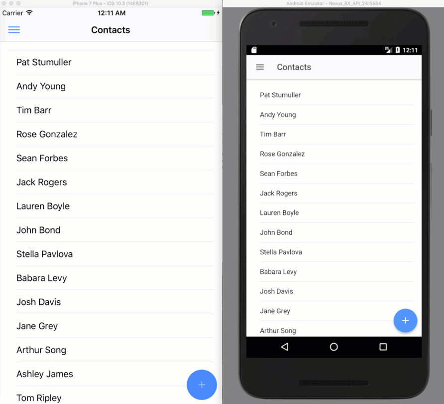

Now that we have the modal [closing properly when editing a contact](https://wipdeveloper.wpcomstaging.com/2017/08/29/salesforce-mobile-sdk-ionic-fixing-navigation/) you may have noticed that the Contacts displayed on our Contacts page are not updated when we return to it from the Contact Details page.

To make it so we can refresh the list on Contacts without using the navigation menu to re-navigate to the Contacts page it would be nice to have a way to refresh the list with a button or maybe pulling the list down to cause a refresh similar to most apps.

## Refresher

The Ionic Framework has a component called Refresher.  Refresher allows you to add the pull to refresh feature with little effort.  So YAY!  Great Job Ionic Peoples!

The basic use of the component looks like this:

#### Refresh Basic Component

<ion-refresher (ionRefresh)="refreshContacts($event)">
  <ion-refresher-content></ion-refresher-content>
</ion-refresher>

This is added at the top of the `ion-content` section before the `ion-list` that displays our contacts.  The `(ionRefresh)="refreshContacts($event)"` property is calling a method on the controller named `refreshContacts` that accepts the event.

The `refreshContacts` method will use the event after the `loadContact` methods promise completes to complete the waiting dialog.

> For this to work I made the `loadContact` method return the promise created when the service is called but didn't have to change anything else.

#### `refreshContacts` Method

refreshContacts(refresher) {

  this.loadContacts()
    .then(() => {

      refresher.complete();
    })
}

#### Updated `loadContacts` Method

loadContacts() {

  return this.service.loadContacts()
    .then(results => {
      console.log(results);
      this.contacts = results.records;
    })
}

And that should be all you need to get basic pull to refresh functionality.

Let's see it in action.

#### iOS and Android Demo

## Conclusion

Don’t forget to sign up for [**The Weekly Stand-Up!**](https://wipdeveloper.wpcomstaging.com/newsletter/) to receive free the [WIP Developer.com](https://wipdeveloper.wpcomstaging.com/) weekly newsletter every Sunday!

Looking for the code and want to follow along?  Find it on [GitHub.com/BrettMN/salesforce-sdk-mobile-with-ionic-starter](https://github.com/BrettMN/salesforce-sdk-mobile-with-ionic-starter)
