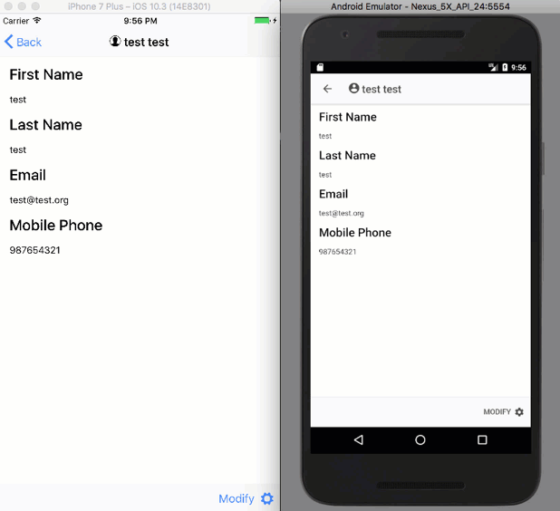

Since we left off in the middle of updating the looks of the actions on our Contact Details page we should probably get back to it.

## More `contact-detail.ts` Updates

The last thing we are going to do is add a method called something like `showActions`, of course, you may choose a different name if that is fancy though.

This method will use the `ActionSheetController` we added as an `import` and injected into the `constructor` as `actionSheetCtrl` to create a new Action Sheet.  In the process of calling create we will pass in an options object that will have a `title` property that will have a value of a string and a `buttons` property.  The `buttons` property will have a value of an array of buttons.

For the title we can use a string template and put the name of the contact we are on.

For the buttons each will have a `title`, an `icon` (provided it's not ios) and a `handler`.  Some buttons will have a `role` property to help position, or color the button depending on the role.

#### `showAction` Method

showActions() {
  let actionSheet = this.actionSheetCtrl.create({
    title: \`Modify ${this.contact.Name}?\`,
    buttons: \[
      {
        text: 'Delete',
        role: 'destructive',
        icon: !this.platform.is('ios') ? 'trash' : null,
        handler: () => {
          actionSheet.onDidDismiss(() => {

            this.deleteContact();
          });
        }
      },
      {
        text: 'Edit',
        icon: !this.platform.is('ios') ? 'build' : null,
        handler: () => {

          actionSheet.onDidDismiss(() => {

            this.updateContact();
          });
        }
      },
      {
        text: 'Cancel',
        role: 'cancel',
        icon: !this.platform.is('ios') ? 'close' : null
      }
    \]
  });

  actionSheet.present();
}

For the button handlers you can see we are calling the `deleteContact` or `updateContact` depending on the button selected when the `onDidDismiss` event it called.

Using `onDidDismiss` allows you to wait till the Action Sheet has been dismissed before calling a followup action or even that may have conflicts if used at the same time.   With out using `onDidDismiss` the Alert Controller's buttons would trigger the methods called but would not dismiss the alert window.

With all that set we will need to update our markup before we can see it in action.

## Update `contact-details.html`

On the `contact-details.html` we will need to remove the buttons we already have in place.  So go on an delete the `Edit` and `Delete` buttons.

With those gone we will add an `ion-footer` that contains an `ion-toolbar`.  The ion-toolbar will contain an `ion-buttons` that has one `button`.  That `button` will have a click handler that calls the `showActions` method.   I'm also going to have the button have text that says `Modify` and an `ion-icon` with a `name` of `settings` so that we the international symbol for change things.... a gear.

The updated `contact-details.html` should look something like this.

#### Updated `contact-details.html`

<ion-header>
  <ion-navbar>
    <button ion-button menuToggle>
      <ion-icon name="menu"></ion-icon>
    </button>
    <ion-title>
      <ion-icon name="contact"></ion-icon> {{contact.Name}}</ion-title>
  </ion-navbar>
</ion-header>

<ion-content padding>
  

    <h3>First Name</h3>
    
{{contact.FirstName}}

    <h3>Last Name</h3>
    
{{contact.LastName}}

    <h3>Email</h3>
    
{{contact.Email}}

    <h3>Mobile Phone</h3>
    
{{contact.MobilePhone}}

  

</ion-content>

<ion-footer>
  <ion-toolbar>
    <ion-buttons end>
      <button ion-button icon-right (click)="showActions()">
        Modify
        <ion-icon name="settings"></ion-icon>
      </button>
    </ion-buttons>
  </ion-toolbar>
</ion-footer>

And now we should be able to run it.

## Run It

Now let's see how it looks when we run it on Android and iOS.

#### Run It

## 

Well that looks a little better.

## Conclusion

Don’t forget to sign up for [**The Weekly Stand-Up!**](https://wipdeveloper.wpcomstaging.com/newsletter/) to receive free the [WIP Developer.com](https://wipdeveloper.wpcomstaging.com/) weekly newsletter every Sunday!

Looking for the code and want to follow along?  Find it on [GitHub.com/BrettMN/salesforce-sdk-mobile-with-ionic-starter](https://github.com/BrettMN/salesforce-sdk-mobile-with-ionic-starter)
