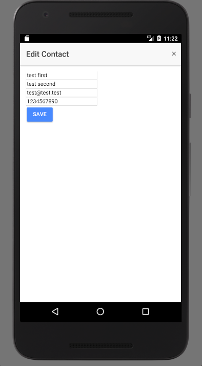
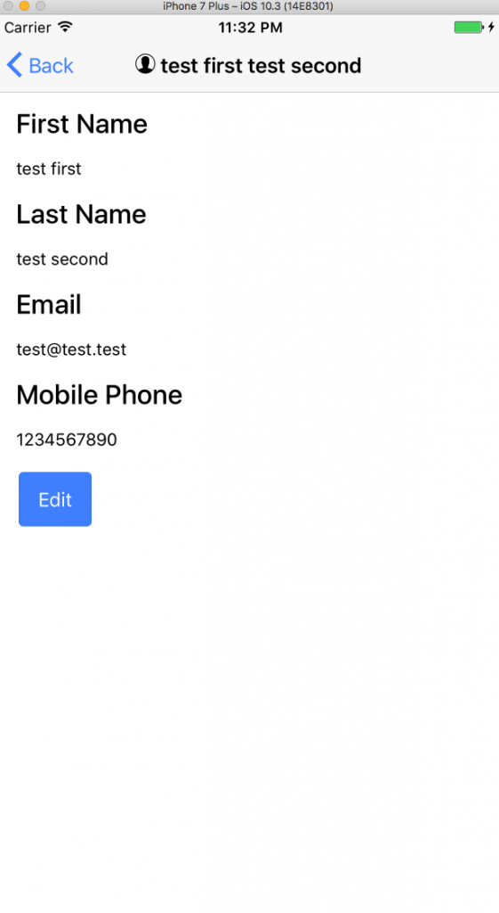
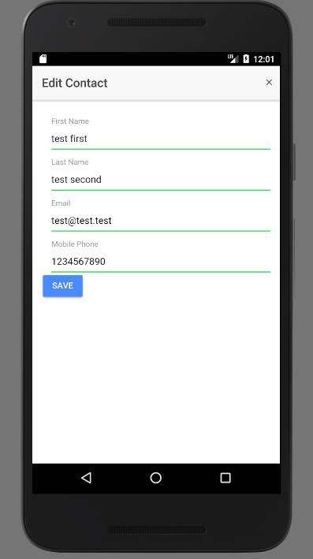
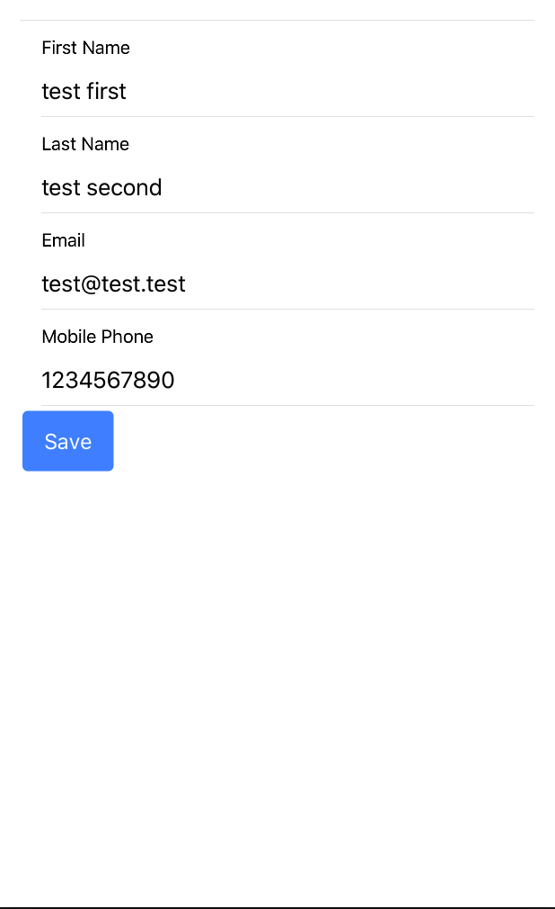
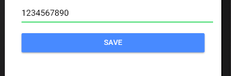
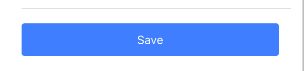

When working on adding the [Add Contacts feature](https://wipdeveloper.wpcomstaging.com/2017/08/09/salesforce-mobile-sdk-ionic-create-object-part-ii/) I noticed I didn't style the [Edit Contact form](https://wipdeveloper.wpcomstaging.com/2017/07/25/salesforce-mobile-sdk-ionic-edit-contact-part-iii/).  And since everyone likes a nice looking form we should probably fix that... and add labels.  There were no labels for the inputs either so let's fix that as well.

## Before

To begin with our original `edit-contact.html` form markup looked like this:

#### `edit-contact.html` Form

<form \*ngIf="contact">
  <label for="FirstName"></label>
  <input type="text" id="FirstName" \[(ngModel)\]="contact.FirstName" name="FirstName">
  <label for="LastName"></label>
  <input type="text" id="LastName" \[(ngModel)\]="contact.LastName" name="LastName">
  <label for="Email"></label>
  <input type="text" id="Email" \[(ngModel)\]="contact.Email" name="Email">
  <label for="MobilePhone"></label>
  <input type="text" id="MobilePhone" \[(ngModel)\]="contact.MobilePhone" name="MobilePhone">
  <button ion-button (click)="saveContact()">Save</button>
</form>

and it rendered something like this:

#### Android

#### iOS

So as you can see, not too pretty.

Let's try to fix that.

## Update `edit-contact.html`

To do this we will need to update the `edit-contact.html` by replacing all those `label`s and `imput`s with `ion-item`s containing `ion-label`s and `ion-input`s.

> Since I enjoy the way the [Floating Labels](http://ionicframework.com/docs/components/#floating-labels) behave I'm going to use those but feel free to use what ever style you like.  They have [Fixed Inline Labels](http://ionicframework.com/docs/components/#fixed-inline-labels), [Floating Labels](http://ionicframework.com/docs/components/#floating-labels), [Inline Labels](http://ionicframework.com/docs/components/#inline-labels), [Inset Labels](http://ionicframework.com/docs/components/#inset-labels), [Placeholder Labels](http://ionicframework.com/docs/components/#placeholder-labels), and [Stacked Labels](http://ionicframework.com/docs/components/#stacked-labels) to choose from.

This means for first name we will replace the exciting `label` and `input`

#### Existing

<label for="FirstName">First Name</label>
<input type="text" id="FirstName" \[(ngModel)\]="contact.FirstName" name="FirstName">

With the Ionic Framework components.

#### Updated

<ion-item>
  <ion-label floating>First Name</ion-label>
  <ion-input type="text" \[(ngModel)\]="contact.FirstName"></ion-input>
</ion-item>

The `ion-item` is used to contain the two child items so they behave accordingly.  The `ion-label` is the Ionic Framework equivalent of a label and `ion-input` the input component. Using these we get a complete mark up for the form like the following:

#### Updated Form

<form \*ngIf="contact">
  <ion-list>
    <ion-item>
      <ion-label floating>First Name</ion-label>
      <ion-input type="text" \[(ngModel)\]="contact.FirstName" name="FirstName"></ion-input>
    </ion-item>
    <ion-item>
      <ion-label floating>Last Name</ion-label>
      <ion-input type="text" \[(ngModel)\]="contact.LastName" name="LastName"></ion-input>
    </ion-item>
    <ion-item>
      <ion-label floating>Email</ion-label>
      <ion-input type="text" \[(ngModel)\]="contact.Email" name="Email"></ion-input>
    </ion-item>
    <ion-item>
      <ion-label floating>Mobile Phone</ion-label>
      <ion-input type="text" \[(ngModel)\]="contact.MobilePhone"name="MobilePhone"></ion-input>
    </ion-item>
    <button ion-button (click)="saveContact()">Save</button>
  </ion-list>
</form>

> I think I forgot to mention this before but we are putting everything except the button in the form in an `ion-list` component.

Now we can rebuild our app and see if things look any better... and have labels.

#### Nicer Looking Form - Android

#### Nicer Looking Form - iOS

While we are here I'm also going to update the look of the save button so that it has some space by wrapping it in a `div` that has a `padding` directive and making the button stretch with the `block` directive.

#### Updated Button Markup

  <button ion-button block (click)="saveContact()">Save</button>

#### Updated Button Look - Android

#### Updated Button Look - iOS

## Conclusion

With this done we don't have to be sooo ashamed of how our edit-contact modal appears.

Don’t forget to sign up for [**The Weekly Stand-Up!**](https://wipdeveloper.wpcomstaging.com/newsletter/) to receive free the [WIP Developer.com](https://wipdeveloper.wpcomstaging.com/) weekly newsletter every Sunday!

Looking for the code and want to follow along?  Find it on [GitHub.com/BrettMN/salesforce-sdk-mobile-with-ionic-starter](https://github.com/BrettMN/salesforce-sdk-mobile-with-ionic-starter)
