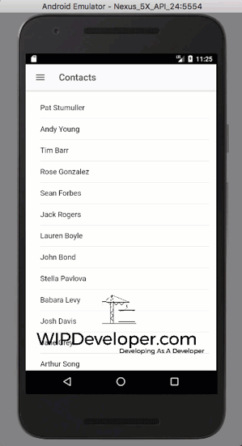
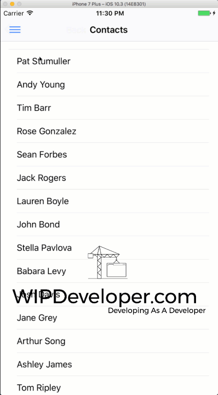

In the process of trouble shooting our issue with saving changes to contacts we have looked at it [on Android](https://wipdeveloper.wpcomstaging.com/2017/07/27/salesforce-mobile-sdk-ionic-debugging-part-ii/) and [on iOS](https://wipdeveloper.wpcomstaging.com/2017/08/02/salesforce-mobile-sdk-ionic-debugging-ios/).  We have one more thing to check before we start, but first a recap.

## Recap

We are trying to update a contact with using the ES6 version of [ForceJS](https://github.com/ccoenraets/forcejs).  On Android we do not get an error but we can a response that  get an `errorCode` of `METHOD_ NOT_ALLOWED` with a `message` of `HTTP Method 'POST' not allowed. Allowed are HEAD, GET, PATCH, DELETE`.  On iOS things are simpler since an error is thrown to the console and it states `TIMING com.salesforce.network.pgSendRequest failed` so it looks like the issue is related to sending the request.

Now before we go to the [SalesforceMobileSDK Google group](https://plus.google.com/u/0/communities/114225252149514546445) I feel we should rule out the  ES6 version of ForceJS.

## Setup ES5 ForceJS

Let's download a copy of [force.js](https://raw.githubusercontent.com/ccoenraets/forcejs/es5/force.js) from the [repo](https://github.com/ccoenraets/forcejs/tree/es5), include it in our `www` folder, and add a reference to it on the `src/index.html`.

#### Reference on `src/index.html`

<!-- For testing purposes only  -->

Now we need to make use of it in our service.

In `src/providers/contacts-service/contacts-service.ts`  we will need use the TypeScript `declare` keyword to inform the transpiler that we are using an object that it doesn't know about so it doesn't throw any errors when we transpile.   Get all that?  Basically we are telling TypeScript that there is an object that will be there so it's ok for us to use it.

#### `declare` `force`

// Tell TypeScript that I know better than it
declare var force :any;

> I'm giving it a type of `any` so I don't have to define everything... basically I'm lazy and we are just using this to prove things are or are not working when using the Salesforce Mobile SDK with the ES5 version of ForceJS

Now we will need to change our `updateContact` method to make use of the `force` that is a global object.

#### Updated `updateContact` Method

updateContact(
    contact:
      {
        Id: string,
        FirstName: string,
        LastName: string,
        Email: string,
        MobilePhone: string,
        Name: string
      }
  ) {

    delete contact.Name;

    return new Promise(function (resolve, reject) {

      force.login(function () {
        console.log('auth success');
        force.update('contact',
          contact ,
          function (result) {
            console.log('update success');
            console.log({ result });
            resolve(result);
          }),
          function (result) {
            console.log('update failed');
            console.log({ result });
            reject(result);
          }
      });

    });
  }

> I'm making use of a promise so I don't have to make any changes elsewhere in our app.

Now we should be ready to run `npm run build` and `cordova prepare` and see if anything is different.

## Run It

And... I know your dying of suspense here.. It's works for both Android and iOS.

#### Android

#### iOS

This means there is either an issue with how I am trying to use the ES6 version or there is an issue with the ES6 version of ForceJS itself.  For now I will use the ES5 version and carry on with the app.

## Conclusion

Well we can edit a contact now, so there's that.

Don’t forget to sign up for [**The Weekly Stand-Up!**](https://wipdeveloper.wpcomstaging.com/newsletter/) to receive free the [WIP Developer.com](https://wipdeveloper.wpcomstaging.com/) weekly newsletter every Sunday!

Looking for the code and want to follow along?  Find it on [GitHub.com/BrettMN/salesforce-sdk-mobile-with-ionic-starter](https://github.com/BrettMN/salesforce-sdk-mobile-with-ionic-starter)
