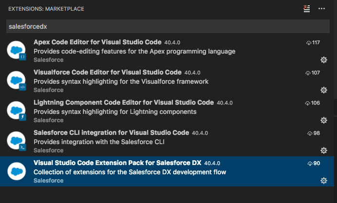

I have/had the honor of presenting at the Minnesota Salesforce Developer Group in Salesforce DX.

More info about the meeting can be found at [Salesforce DX and developing with security in mind](https://www.meetup.com/SFTCDUG/events/241205107/).

It was a great time, with wonderful presentations about TrailheaDX by James Loghry and Developing with Security in Mind by Davin Leier and Barry Bakunowicz.

## Video

<iframe src="https://www.youtube.com/embed/tkOXPXLZsDw" width="560" height="315" frameborder="0" allowfullscreen="allowfullscreen"></iframe>

## Links

Here are the links that were on the last slide of the presentation.

[​Sign up for Demo org](https://developer.salesforce.com/promotions/orgs/dx-signup)

​[Trailhead: Get Started with Salesforce DX](https://trailhead.salesforce.com/en/trails/sfdx_get_started)

[Salesforce DX Setup Guide (Beta)](https://developer.salesforce.com/docs/atlas.en-us.208.0.sfdx_setup.meta/sfdx_setup/sfdx_setup_intro.htm)​

[Salesforce CLI](https://developer.salesforce.com/tools/sfdxcli)

[​Cheat Sheet](https://drive.google.com/file/d/0B9HduBZJMbH2VDg2TmQwLUZmMGM/view) by [@SNUGSFBay](https://twitter.com/SNUGSFBay)

[Visual Studio Code Extension Pack for Salesforce DX](https://marketplace.visualstudio.com/items?itemName=salesforce.salesforcedx-vscode)

> If installing from the Extension Menu in Visual Studio Code be sure to grab the correct one.
> 
> #### Visual Studio Code Extension Pack for Salesforce DX
> 
> 

## Unanswered Questions

- What is the difference between Environment Hub and Developer Hub (Dev Hub)?
    - Environment Hub lets partners view, connect, create, and log in to multiple Salesforce organizations from one location. ([source](https://partners.salesforce.com/s/education/general/Environment_Hub))
    - The Dev Hub allows users, Admin by default, create and manage scratch orgs from the command line and Lightning Experience. ([source](https://developer.salesforce.com/docs/atlas.en-us.208.0.sfdx_setup.meta/sfdx_setup/sfdx_setup_enable_devhub.htm))
- Can you disable the Dev Hub once it's enabled?
    - No ([source](https://developer.salesforce.com/docs/atlas.en-us.208.0.sfdx_setup.meta/sfdx_setup/sfdx_setup_enable_devhub.htm))
- Can Sandbox Orgs be Dev Hubs?
    - No?  On the Salesforce DX page it says to turn on the Dev Hub in your Production or Business Org. ([source](https://developer.salesforce.com/platform/dx))
- Can you restrict Developers from using Salesforce DX on a Production Org?
    - By default the permissions to related to Salesforce DX are assigned to the System Administrator profile. ([source](https://developer.salesforce.com/docs/))  These permisions can be assigned to non-System Administrators through permission sets. ([source](https://developer.salesforce.com/docs/#perms))
- Is there a side effect of enabling the Dev Hub and not using it?
    - Aside from the System Administrators having something else to ignore I am unaware of any negative side effects of not using the Dev Hub features once they are enabled.  (no source)
- When data is loaded from JSON files using `force:data:tree:import` does it maintain relationships?
    - Yes, this data can contain master-detail relationships. ([source](https://developer.salesforce.com/docs/atlas.en-us.sfdx_cli_reference.meta/sfdx_cli_reference/cli_reference_force_data.htm?search_text=force:data:tree:import))

## Conclusion

I'll try to add some more information later maybe

Don’t forget to sign up for [**The Weekly Stand-Up!**](https://wipdeveloper.wpcomstaging.com/newsletter/) to receive free the [WIP Developer.com](https://wipdeveloper.wpcomstaging.com/) weekly newsletter every Sunday!
