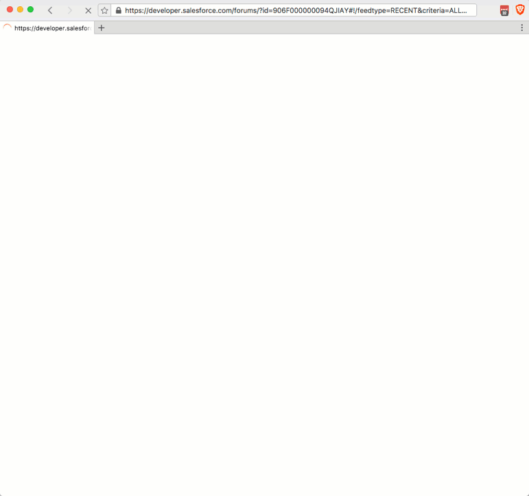
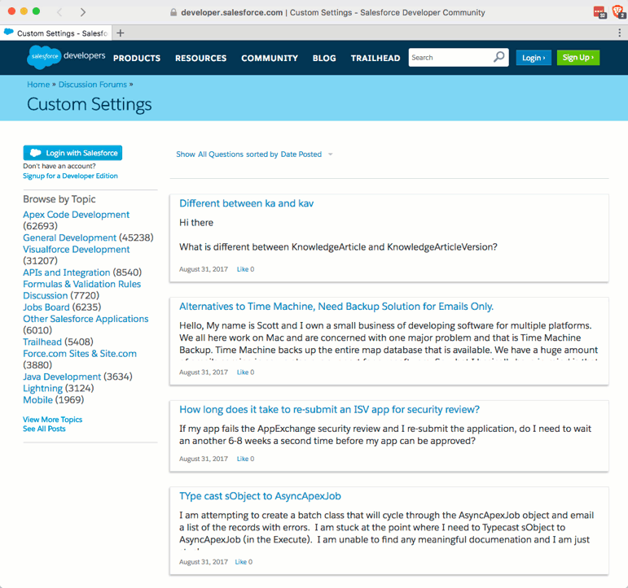

Have you ever been searching on your favorite search engine for an issue related to Salesforce, find an answer on [developer.salesforce.com/forums](https://developer.salesforce.com/forums/) only to have it default to show all posts when you click the link?

It's annoying, right?  Especially when the answer you want flashes on the screen before the page re-renders all answers.

#### Example

I've seen it happen with Bing and DuckDuckGo.  I'm sure I have had it happen with Google.

## Solution

So there's a way to get to the article you want and no, it has nothing to do with logining in to Salesforce.

In the URL you may have noticed that it has a `#!` in it.  Just delete it and everything after it and it should load your article appropriately.

So if you wanted to see this article/post on Custom Settings

#### Before

https://developer.salesforce.com/forums/?id=906F000000094QJIAY#!/feedtype=RECENT&criteria=ALLQUESTIONS&

#### After

https://developer.salesforce.com/forums/?id=906F000000094QJIAY

#### Success

 

Now, hopefully, you can get the information you need and continue on your merry developing way.

## Conclusion

Don’t forget to sign up for [**The Weekly Stand-Up!**](https://wipdeveloper.wpcomstaging.com/newsletter/) to receive free the [WIP Developer.com](https://wipdeveloper.wpcomstaging.com/) weekly newsletter every Sunday!
