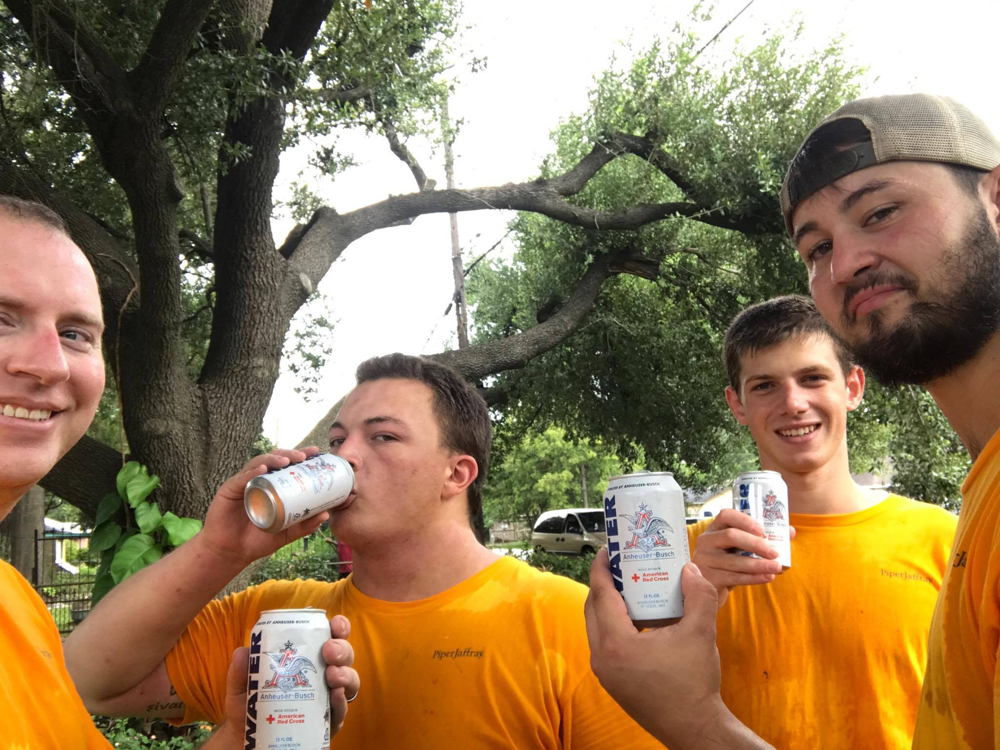

Last week I spent time helping with the recovery from Hurricane Harvey in Houston Texas.  I went with a team of 15 others from my [Crossroads Church](http://www.crossroadschurch.cc/) to assist with mucking and gutting houses.

## Houston

The areas we worked in were either flooded when water was released from the local dams (ref: [Houston Floodwaters Rise as 2 Dams and Levee Overflow](http://time.com/4920465/houston-hurricane-harvey-dam-levee-overflow/)) or, in North Rosenberg, the river over flowed from the bank.

In North Rosenberg we assisted an organization called the [Friends of North Rosenberg](https://www.facebook.com/Friends-of-North-Rosenberg-1444144769156884/).  They don't specialize in disaster recovery, they focus on "Strengthening North Rosenberg through spiritual growth, education, revitalization and basic needs."  As a local community organization they could use any donations made on their [Facebook page](https://www.facebook.com/Friends-of-North-Rosenberg-1444144769156884/) to improve local conditions.

\[gallery ids="3448,3463,3462,3458,3457,3465,3455,3453,3451,3450,3449" type="rectangular" link="none"\]

Most of our efforts was coordinated though [Merge Ministries](http://www.covmerge.org/) around the rest of Houston.

## Other Disasters

This was of course shortly after Hurricane Irma hit.  And while we were in Houston an earth quake hit Mexico city and Hurricane Maria slammed Puerto Rico.

If you are in a position to help out, please do so.

[Hurricane Maria Children's Relief Fund](https://secure.savethechildren.org/site/c.8rKLIXMGIpI4E/b.9535647/k.A2B9/Hurricane_Maria_Childrens_Relief_Fund/apps/ka/sd/donor.asp)

[Hurricane Maria Disaster Relief](https://donate.worldvision.org/give/hurricane-maria-disaster-relief)

[Mexico Earthquake Relief](https://donate.worldvision.org/give/mexico-earthquake-relief)

[Hurricane Irma Disaster Relief](https://donate.worldvision.org/give/hurricane-irma-disaster-relief)

[Hurricane Harvey Disaster Relief](https://donate.worldvision.org/give/hurricane-harvey-disaster-relief)

[Friends of North Rosenberg](https://www.facebook.com/Friends-of-North-Rosenberg-1444144769156884/)

[Merge Ministries](http://www.covmerge.org/)

Anything you can give could make a difference.

## Thanks

For the organizations that supported us, either knowingly with beer water or unknowingly with t-shirts, hats, and hand sanitizer.

#### Beer Water

