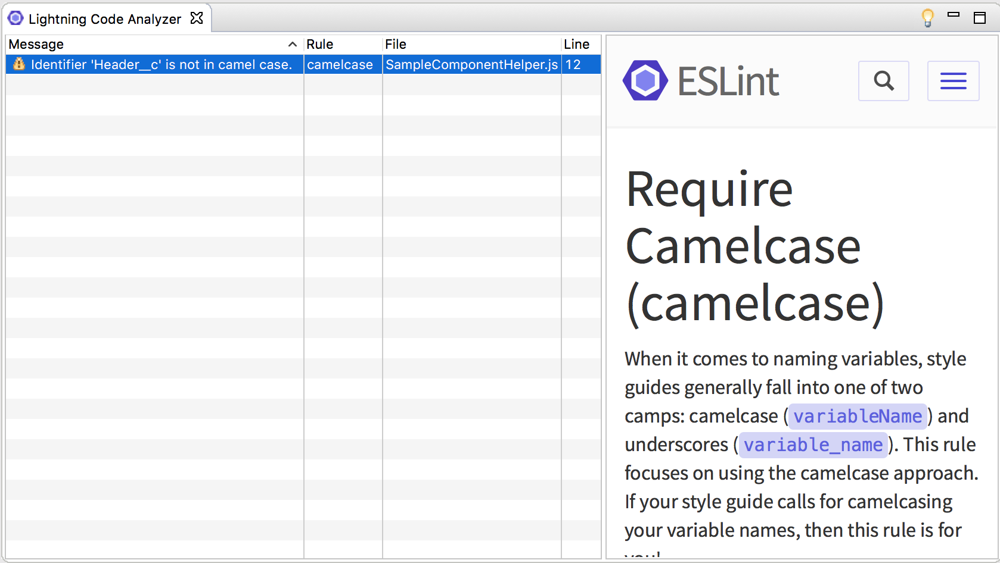

If you have taken the chance to check out the [Force.com IDE 2 beta](https://developer.salesforce.com/tools/forceide2) you may have noticed a tab called "Lightning Code Analyzer".  This area will point out coding rule violations that the developers at Salesforce feel should be followed.  While most of them are probably good rules, sometimes you need to break the rules to get some work done.

## Rule Violation!!!

So I came across this when I was working by mocking the results of a call to an `@auraenabled` Apex method.  I didn't have the Apex written yet and if I did the org would not have had sample data that would have enabled so I created a method to return sample data in the form of an object that I expect from Salesforce.

#### `mockDataCall`

mockDataCall: function(callback){
  var sampleData = {
    Header\_\_c : 'Sample Component!!'
  };

  callback(sampleData);
}

Looking at this you may think "What's wrong with that?" well the Lightning Code Analyzer is built on [JSHint](http://jshint.com/) and one of the rules that it is checking for is proper use of camelcase for identifier names.

In this case I have named a property starting with a capital letter.  So it's not camelcase.

#### Lightning Code Analyzer Window

> You can see a window that explains what the error means when you select it on the right btw

I think this is pretty neat.

This is I was mocking a collection of objects about 10 that had maybe 10 properties each so that's 100 errors.  With 100 errors displayed at all times there isa  good chance I would miss something that would be useful.

This is not neat.

But what to do?

## Disable 1 Rule in a File

To clear up the Lightning Code Analyzer window so we can see only relevant issues.  Relevant in this case is things that are done deliberately not things that are done because I'm lazy.

Well ESLint has the ability to set a property for linting in the file.  In our case we want to set [camelcase](https://eslint.org/docs/rules/camelcase#never) to never check.

In our file we would add a `/* eslint camelcase: ["error", {properties: "never"}] */` to our helperfile before the method that mocks the data loading.

#### Updated `mockDataCall`

/\* eslint camelcase: \["error", {properties: "never"}\] \*/
mockDataCall: function(callback){
  var sampleData = {
    Header\_\_c : 'Sample Component!!'
  };

  callback(sampleData);
}

And our error should go away.

## Conclusion

Don’t forget to sign up for [**The Weekly Stand-Up!**](https://wipdeveloper.wpcomstaging.com/newsletter/) to receive free the [WIP Developer.com](https://wipdeveloper.wpcomstaging.com/) weekly newsletter every Sunday!

Looking for the code and want to follow along?  Find it on [GitHub.com/BrettMN/salesforce-sdk-mobile-with-ionic-starter](https://github.com/BrettMN/salesforce-sdk-mobile-with-ionic-starter)
