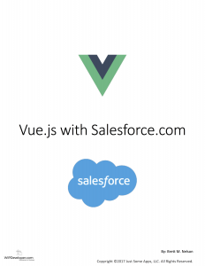

Some of you may know I have been working on a project about using Vue.js with Salesforce. **Surprise!** it's a book!  **[Vue.js with Salesforce.com](https://wipdeveloper.wpcomstaging.com/product/vue-js-salesforce-com/)** is now available for order.

If you are part of the [Weekly Stand-up!](https://wipdeveloper.wpcomstaging.com/newsletter/) you already are aware of some of this but for the rest of you... [Sign up!](https://wipdeveloper.wpcomstaging.com/newsletter/) also here is some information about [**Vue.js with Salesforce.com**](https://wipdeveloper.wpcomstaging.com/product/vue-js-salesforce-com/).

> [**Vue.js with Salesforce.com**](https://wipdeveloper.wpcomstaging.com/product/vue-js-salesforce-com/) is an entry level book designed to help a developer gain an understanding of Vue.js and start using it with Salesforce.com.

#### Bonus:

If you purchase before the current sale ends, I will be asking for your direct feedback on how to improve it.  Either through Email or possibl**y** through a Slack setup. I haven’t decided yet, there will be more to come on that.

#### Price:

I mentioned sale... so until Friday I am offering it at a discounted price of $9.77.  After this week the price will go up.

#### Distributed:

Once purchased the book is available through a download link you will be directed to and a copy of the link is included with your purchase.

#### Formats:

epub and mobi, this means most ebook readers should be covered but I am working on getting a pdf to convert properly to include in the distribution.

#### Payment Options:

Paypal and Stripe, so most credit cards should work.

#### Code:

Will be included in a future release.

#### Warning:

This is a work in progress and some polish is needed.  Any feedback during these stages will be greatly appreciated.

## Conclusion

Don’t forget to sign up for [**The Weekly Stand-Up!**](https://wipdeveloper.wpcomstaging.com/newsletter/) to receive free the [WIP Developer.com](https://wipdeveloper.wpcomstaging.com/) weekly newsletter every Sunday!
