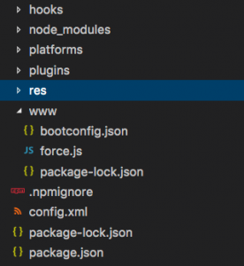
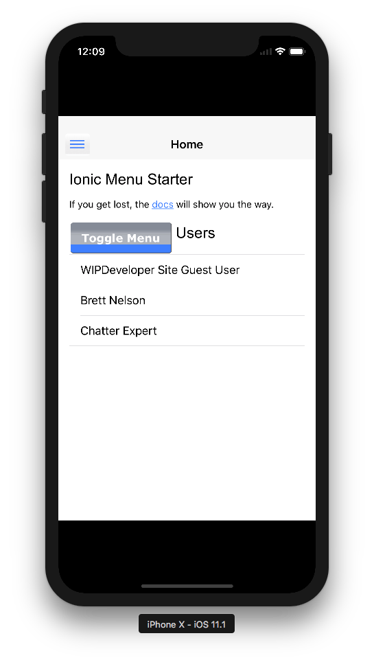

[Last time](https://wipdeveloper.wpcomstaging.com/2017/10/16/salesforce-mobile-sdk-ionic-setup-remote-hybrid-app/) we set up our Visualforce page and a Remote Hybrid app. Now we just need to add all the local assets for out app.

## Adding Local Assets

Adding the local assets is going to be pretty easy if you have been following along.  We will be copying and pasting the contents of our original Local Hybrid app into our shinny new Remote Hybrid app. This process will be similar to when we added the [Ionic Framework to the Salesforce Mobile SDK](https://wipdeveloper.wpcomstaging.com/2017/07/04/saleforce-mobile-sdk-and-ionic-adding-ionic-to-mobile-sdk-part-i/) where we copied the files and folders that the Ionic CLI created into the project structure that the ForceIOS or ForceDroid created.

> If you didn't follow along you can use a new Ionic Framework app and move over the same parts. See [Saleforce Mobile SDK and Ionic – Setup the Ionic Framework](https://wipdeveloper.wpcomstaging.com/2017/07/04/saleforce-mobile-sdk-and-ionic-adding-ionic-to-mobile-sdk-part-i/) for more information on how to set up an Ionic Framework app.

We will start with our fresh remote app files:

#### Fresh Remote Files

And move over our `tslint.json`, `tsconfig.json`, and `ionic.config.json` files.  We will also need our `/resource`, and `/src` folders.

We will also need to copy over our Ionic related dependencies and scripts in our `package.json` and the `config.xml`.  This is the same as we did in [Salesforce Mobile SDK and Ionic – Adding Ionic to Mobile SDK – Part I](https://wipdeveloper.wpcomstaging.com/2017/07/04/saleforce-mobile-sdk-and-ionic-adding-ionic-to-mobile-sdk-part-i/) so I wont bore you with those details again.

## Run It

With everything copied over we are almost ready to run it.  First we will need to run `npm install`

> Don't forget to uninstall and re-install your Salesforce Mobile SDK before performing `cordova prepare`
> 
> cordova plugin remove com.salesforce
> cordova plugin add https://github.com/forcedotcom/SalesforceMobileSDK-CordovaPlugin --force

Once you app is ready we will have to make one change for things to work properly with iOS.  Open up your the workspace in xCode and navigate to the `AppDelegate+SalesforceHybridSDK.m` file.  We will be replacing the following line:

#### Out with the 'Old'

self.viewController = \[\[SFHybridViewController alloc\] initWithConfig:(SFHybridViewConfig\*)\[SalesforceSDKManager sharedManager\].appConfig\];

With this line:

#### In with the New

self.viewController = \[\[SFHybridViewController alloc\]initWithConfig:(SFHybridViewConfig\*)\[SalesforceSDKManager sharedManager\].appConfig useUIWebView:YES\];

And Now things should Run

#### Running App

## Conclusion

Don’t forget to sign up for [**The Weekly Stand-Up!**](https://wipdeveloper.wpcomstaging.com/newsletter/) to receive free the [WIP Developer.com](https://wipdeveloper.wpcomstaging.com/) weekly newsletter every Sunday!
