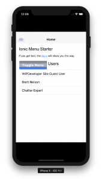
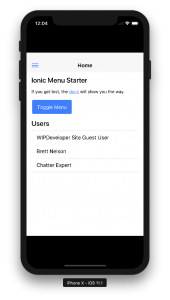

Previously we ran our Remote Hybrid app and it had all the functions of our Local Hybrid app but something didn't look quite right.  The styling was off!  Let's take a quick look and see what may have caused this.

## The Issue

If you look at our current Remote Hybrid app it's a little off from the styling we would/should expect when using the Ionic Framework.

### Current Remote Hybrid App

## The Fix

This is being caused by Salesforce.  When we [set up our Visualforce page](https://wipdeveloper.wpcomstaging.com/2017/10/16/salesforce-mobile-sdk-ionic-setup-remote-hybrid-app/) we did not include the `standardStylesheets` attribute with a value of false.  If we update our `apex:page` tag to include this:

#### Updated `apex:page`

<apex:page
        docType="html-5.0"
        showHeader="false"
        sidebar="false"
        standardStylesheets="false">

We should be able to reload our app and see the styles update.

### Updated Remote Hybrid App

## Conclusion

As you can see one of the effects of a Remote Hybrid app is that we can cause changes to the app from Salesforce.

Don’t forget to sign up for [**The Weekly Stand-Up!**](https://wipdeveloper.wpcomstaging.com/newsletter/) to receive free the [WIP Developer.com](https://wipdeveloper.wpcomstaging.com/) weekly newsletter every Sunday!
