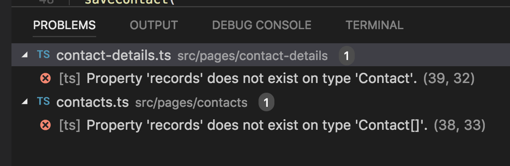
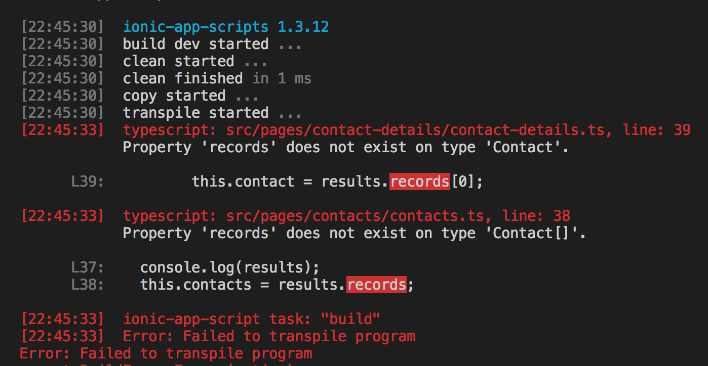
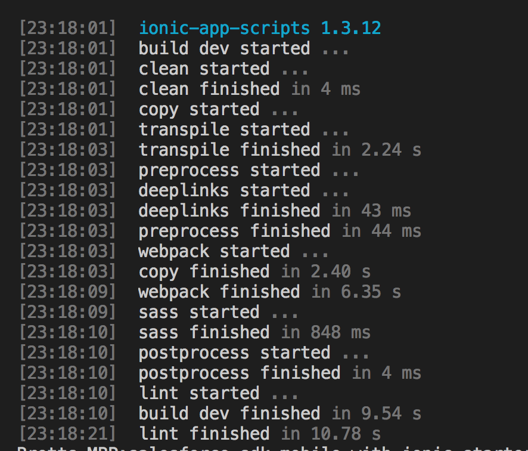
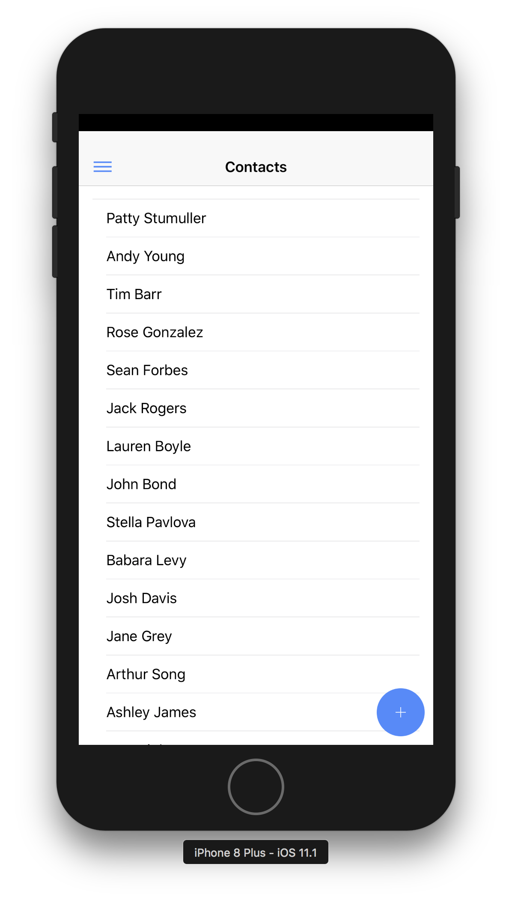
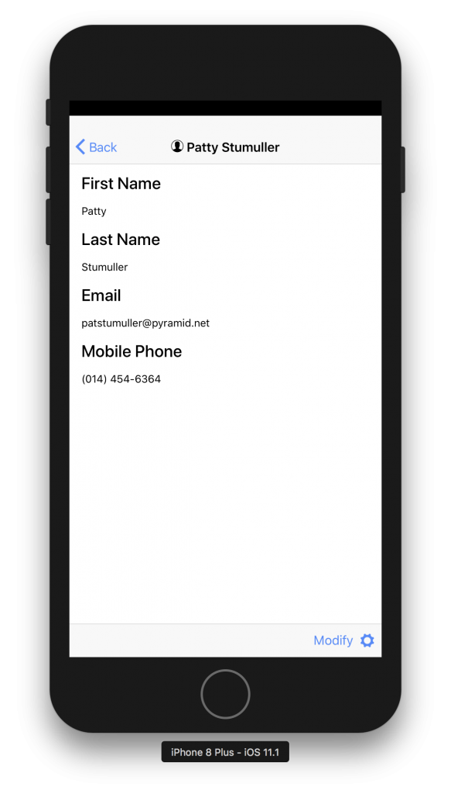

With our newly added class of `Contact` we should be able to find any issues that will arise from switching to Remote actions.

## See the errors yet?

If you are using an editor like VisualStudio Code you can look in the "Problems" tab/window to see any issues our new definitions have caused.

#### Problems

If you are not using an editor with this feature try running `npm run build` and see what happens.

#### `npm run build` Results

#### 

Uh Oh! There are Errors... oh wait... that's what we wanted.

You can see it points out what files and where in the files the errors are located.   Now we just need to update those 2 files and we should be all set.

## Fix the Errors

Lets first edit the `contacts.ts` on line `38` we will change the `results.records` to `results` since our RemoteAction in the Apex controller returns the results directly and does not put the results in a records property of the returned object.

#### `contacts.ts`  `loadContacts()` Before

loadContacts() {

  return this.service.loadContacts()
    .then(results => {
      console.log(results);
      this.contacts = results.records;
    })
}

#### `contacts.ts` `loadContacts()` After

loadContacts() {

  return this.service.loadContacts()
    .then(results => {
      console.log(results);
      this.contacts = results;
    })
}

The other error is in the `contact-details.ts` so let's change the `results.records[0]` to `results` so we can build our app and see if we missed anything.

#### `contact-details.ts` `getContact()` Before

getContact(id: string) {
  this.service.getContact(id)
    .then(results => {

      this.contact = results.records\[0\];
    })
}

#### `contact-details.ts` `getContact()` After

getContact(id: string) {
  this.service.getContact(id)
    .then(results => {

      this.contact = results;
    })
}

## Run It

Now we should be able to `npm run build` and not have any errors:

#### Error Free

So we should be able to run it and see our contacts list and contacts details.

#### Contact List

#### Contact Details

## Conclusion

Don’t forget to sign up for [**The Weekly Stand-Up!**](https://wipdeveloper.wpcomstaging.com/newsletter/) to receive free the [WIP Developer.com](https://wipdeveloper.wpcomstaging.com/) weekly newsletter every Sunday!
