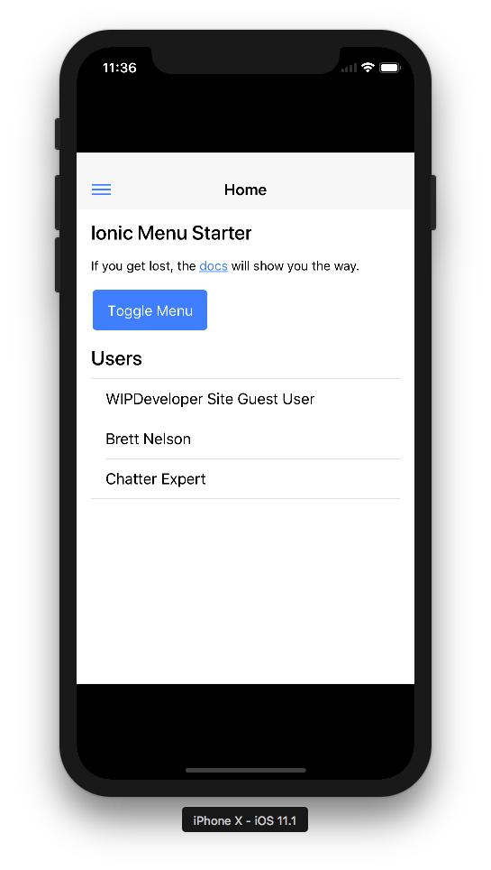
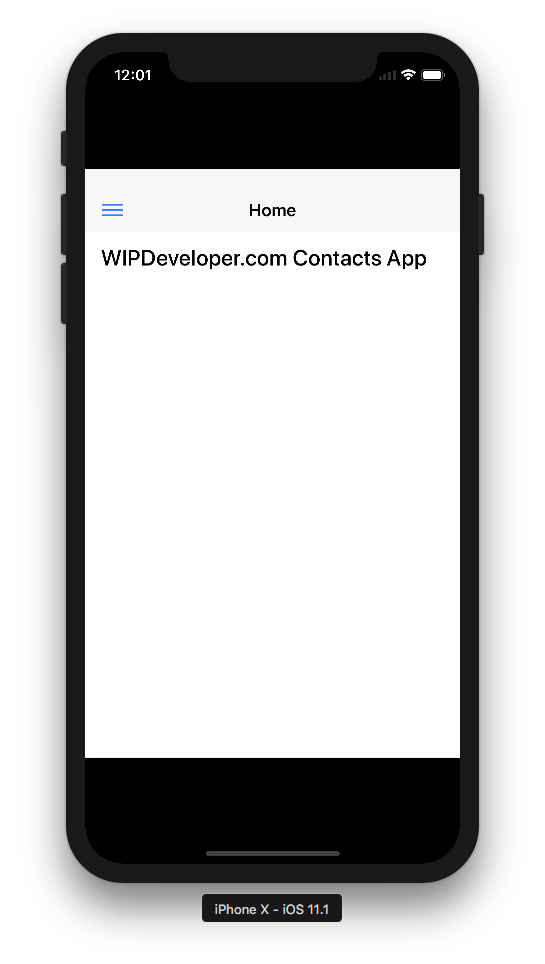

One of the reason to build a Remote Hybrid app is so that you can make changes to it without having to rebuild and resubmit it to a store.  Since the main view is a Visualforce page we can make changes to it in Salesforce and see them instantly in our app.

## Update the Visualforce

Since our app is now a working website with some portions saved in the device and some portions coming from Salesforce we could update a portion of the app, or even the whole app, without interrupting a user.  Just edit the Visualforce :)

In our case we may want to update the Home screen since we don't want it saying `Ionic Menu Starter` any more.  Problem is it's the holiday season and we want to make sure our app is working properly without waiting for it to go through any review process delays.

#### Old Home Screen

Instead we want it to say something like `WIPDeveloper.com Contacts App` and nothing else.

So in the `home/home.html` I'm going to change the `<h3>` to `WIPDeveloper.com Contacts App` and remove everything else in the content.

#### Updated `home/home.html`

<ion-header>
  <ion-navbar>
    <button ion-button menuToggle>
      <ion-icon name="menu"></ion-icon>
    </button>
    <ion-title>Home</ion-title>
  </ion-navbar>
</ion-header>

<ion-content padding>
  <h3>WIPDeveloper.com Contacts App</h3>
</ion-content>

Save it and run `npm run build`.  This will generate new `main.js` and `main.js.map` files.  Lets create a StaticResource and put these updated files in in.  I'm going to call mine `ContactsApp` and save it to Salesforce.

Now on our Visualforce page let's update it to use the `main.js` file from our static resource.

#### Old `main.js` Script Tag

<!-- The bundle js is generated during the build process -->

#### New `main.js` Script Tag

<!-- The bundle js is generated during the build process -->

Now if we re-run the app things should look a little different.

#### New Home Screen

Yeah, ok.  It may be a little bland but it proves we can update the app without updating the app that is sent through the app stores.

## Conclusion

Don’t forget to sign up for [**The Weekly Stand-Up!**](https://wipdeveloper.wpcomstaging.com/newsletter/) to receive free the [WIP Developer.com](https://wipdeveloper.wpcomstaging.com/) weekly newsletter every Sunday!
