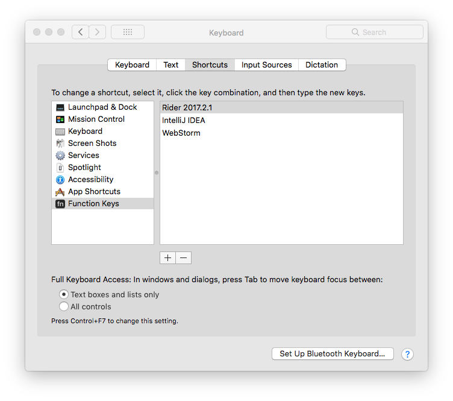
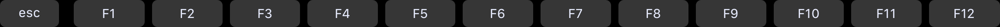

If you have been wondering about how to get dedicated function keys set for your IDE/text editor of choice.  Here's a little Gem I found the other day with some help from [Jeremy Ross](https://twitter.com/jeremyross).

## The Issue

I've been using IntelliJ IDEA with [Illuminated Cloud 2](http://www.illuminatedcloud.com/) and some of the key combinations are 3 or 4 simultaneous presses one of witch could be a function key (f1-f12).  This makes it a total of up to 5 keys I would need to press at once... and I can't remember that many at a time so.  I decided to try an remove a key.

So to speak since technically the Touch bar has no keys.

#### Default Touch Bar

#### 

I had heard about BetterTouchTool and gave it a try but I was not able to choose the default function keys.  I could recreate them but the spacing was off and it seemed like a lot of work.

## The Solution:

I ended up finding that you are able to assign the function keys to specific programs in the settings.  To do this:

1. Open **`System Preferences`**
2. Then open **`Keyboard`**
3. Choose the **`Shortcuts`** tab
4. Select `Function Keys` on the right hand side
5. Use the `+` to add programs that will use the function keys

I added 3 programs so far so it looks like this:

#### Programs that default to Function Keys

#### Function Keys

#### 

Now my IDEs show function keys and I can still pull up the other Touch Bar short cuts by holding the `fn` key.... I probably wont be doing that too much though.

## Conclusion

Don’t forget to sign up for [**The Weekly Stand-Up!**](https://wipdeveloper.wpcomstaging.com/newsletter/) to receive free the [WIP Developer.com](https://wipdeveloper.wpcomstaging.com/) weekly newsletter every Sunday!
