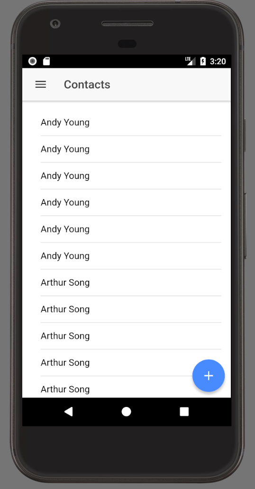

So far, in regards to our soups,  we have [populated a soup](https://wipdeveloper.wpcomstaging.com/2017/12/13/salesforce-mobile-sdk-and-ionic-offline-smartstore-saving-data/) and [returned everything from a soup](https://wipdeveloper.wpcomstaging.com/2017/12/18/salesforce-mobile-sdk-and-ionic-offline-smartstore-query-all-data/) but what if we want to delete the contents or empty or clear a soup out before we fill it?  Conveniently there is a way to do that with `clearSoup`.

## ClearSoup

You may be wondering why we would want to clear the soup out.  Well sometimes it's nice to start fresh, in our case we aren't mapping our results when we fill the soup so if you fill it a few times you are going to see some duplicate entries.

#### Dupes!

> As you can see we probably want to avoid showing 6 of the same entry.

In our `SmartStoreServiceProvider` lets modify the `fillSoup` method so that is always clears the `contacts` soup before filling it.

To clear out a soup is rather easy, we will call the `smartstore.clearSoup` method with the name of the soup.  It can also take a success callback and a failure callback.

For our `fillSoup` method we will add the call to clear the soup in the resolve for the promise of the `contactsService.loadContacts` method before we upsert the results to the SmartStore Soup.  We will use the success callback of the `clearSoup` method to perform the upsert.

This probably sounds a bit complicated but looking at it might help.

#### Updated `fillSoup` Method

fillSoup() {

  console.log('fillSoup')

  return this.contactsService.loadContacts()
    .then(results => {

      let success = (items) => console.log(\`Items upserted to Soup: ${items}\`);

      let failure = (error) => console.error(\`Soup Upsert Error: ${error}\`);

      (navigator as sdkNavigator).smartstore.clearSoup(this.soupName, () =>
        this.smartStore().upsertSoupEntries(this.soupName, results.records, success, failure)
      );
    })
}

As you can see we used an inline arrow function for the success callback.   It the success callback was going to be more complicated I would recommend separating it out like the callbacks for the `upsertSoupEntries` are.

Now we can call `fillSoup` all day long and it wont have any duplicate entries since each time it will clear the soup

## Conclusion

Don’t forget to sign up for [**The Weekly Stand-Up!**](https://wipdeveloper.wpcomstaging.com/newsletter/) to receive free the [WIP Developer.com](https://wipdeveloper.wpcomstaging.com/) weekly newsletter every Sunday!
