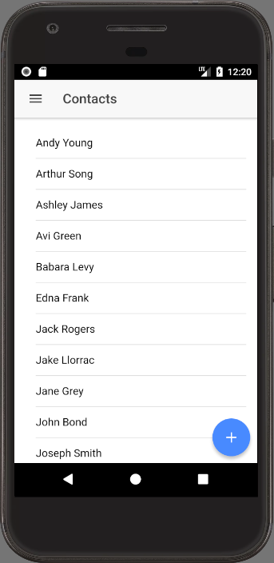

Since we are going to use the `SmartstoreService` as a drop in replacement for the `ContactsService` we will have to add in the methods that the `ContactsService` was providing for use.  Let's start by adding in the `loadContacts` call that is used by the `contacts` view to list...well.. contacts.

## `SmartStoreService.loadContacts`

This new `loadContacts` method to return a promise to conform with our existing code.  And since we are getting the data from our soup, we will need a `querySpec` similar to when we [queried for everything](https://wipdeveloper.wpcomstaging.com/2017/12/20/salesforce-mobile-sdk-and-ionic-offline-smartstore-query-all-data-ii/).

We can use the `reject` portion of the promise as our failure callback.

For the success callback we will need to customize it a a bit.  On success we will call resolve on a custom object that has a property names `records`.  For the caly we will assign the `results.currentPageOrderedEntries`.  This will allow the `contacts` page to use the resulting promise resolution without any changes.

#### `loadContacts`

loadContacts(): Promise<any> {

  console.log('loadContacts');

  return new Promise((resolve, reject) => {

    var querySpec = (navigator as sdkNavigator).smartstore.buildAllQuerySpec('Name', 'ascending', 50);

    let success = (results) => resolve({ records: results.currentPageOrderedEntries });

    (navigator as sdkNavigator).smartstore.querySoup(this.soupName, querySpec, success, reject);

  });

}

Now we should be able to build our app, run it and only load the contacts the first time the app opens.

#### Contacts List from the `soup`

## Conclusion

Don’t forget to sign up for [**The Weekly Stand-Up!**](https://wipdeveloper.wpcomstaging.com/newsletter/) to receive free the [WIP Developer.com](https://wipdeveloper.wpcomstaging.com/) weekly newsletter every Sunday!
