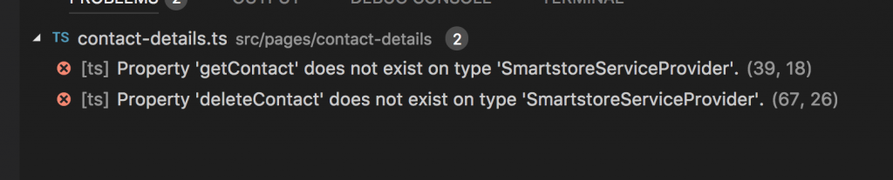

Since we now know how to [use the SmartStore `buildExactQuerySpec`](https://wipdeveloper.wpcomstaging.com/2018/01/10/salesforce-mobile-sdk-ionic-offline-smartstore-query-exact/) how about we adapt it to our use by getting the specific contact we select on the `contactsDetails` view from the SmartStore instead of calling back to Salesforce.  To do that we will have to ensure that our `SmartstoreServiceProvider` matches the same `type` as our `ContactsServiceProvider`.  We can continue to add methods as we encounter then missing or we could use a feature of TypeScript to `extend` our `ContactsServiceProvider` with the `SmartstoreServiceProvider`.

## Consume the `SmartStoreService`

The first step will be to consume the `SmartstoreServiceProvider` instead of the `ContactsServiceProvider` in the `ContactsDetailsPage` constructor.

> This is similar to the change we made for the for the `ContactsPage` a [few posts ago](https://wipdeveloper.wpcomstaging.com/2018/01/01/salesforce-mobile-sdk-ionic-offline-consume-smartstoreservice/).

Near the top of `contacts-details.ts` we will remove the import for `ContactsServiceProvider` and replace it with an import for `ContactsServiceProvider`

#### Update Imports

// import { ContactsServiceProvider } from '../../providers/contacts-service/contacts-service';

import { SmartstoreServiceProvider } from '../../providers/smartstore-service/smartstore-service';

In the `constructor` we need to change the type of the `service` to reflect this change in imports as well

#### Update `constructor`

constructor(
  public navCtrl: NavController,
  public navParams: NavParams,
  public modalCtrl: ModalController,
  // private service: ContactsServiceProvider,
  private service: SmartstoreServiceProvider,
  public alertCtrl: AlertController,
  public actionSheetCtrl: ActionSheetController,
  public platform: Platform,
  private emailer: EmailComposer
) { }

This of course will cause an error once TypeScript notices our `SmartStoreService`  does not contain the all the methods the contacts service provides.

#### TypeScript Errors

Lets fix those real quick.

## Extend in Action

We probably should have done this sooner but it didn't really become that apparent about what was missing in the  `SmartstoreServiceProvider`  till it was time to use it in the `contacts-details.ts`.  We could keep adding methods to cover missing features but there is another option with TypeScript that I feel would better suit us.  We will `extend` the `ContactsServiceProvider` with `SmartstoreServiceProvider`.  This is TypeScripts way of doing inheritance.

With `extend`, or inheritance, one class will have all the functionality, such as methods, as it's parent or base class.  In our case the base class is `ContactsServiceProvider` and `SmartstoreServiceProvider` is the child or subclass.

We will be able to access properties and methods defined on the parent class by using the `super` keyword.

Since we already have the import for `ContactsServiceProvider` in our `SmartstoreServiceProvider` the main change will be removing it as an property on the constructor, adding a call to `super` in the constructor and adding the `extend` syntax to the class declaration.

#### Updated Class Declaration

export class SmartstoreServiceProvider extends ContactsServiceProvider {

#### Updated Constructor

 constructor(){

    super();

// rest of constructor here 

}

> In the constructor you have to call `super` before performing any other actions.  This is so that anything defined in the parent will be properly initialized before further actions occur.

Now we have one more change to make.  In the `fillSoup` method we will change the call of `this.contactsService.loadContacts` to `super.loadContacts`

#### Old Line

eturn this.contactsService.loadContacts()

#### New Line

return super.loadContacts()

With this done all our current errors should be taken care of.

## Conclusion

Don’t forget to sign up for [**The Weekly Stand-Up!**](https://wipdeveloper.wpcomstaging.com/newsletter/) to receive free the [WIP Developer.com](https://wipdeveloper.wpcomstaging.com/) weekly newsletter every Sunday!
