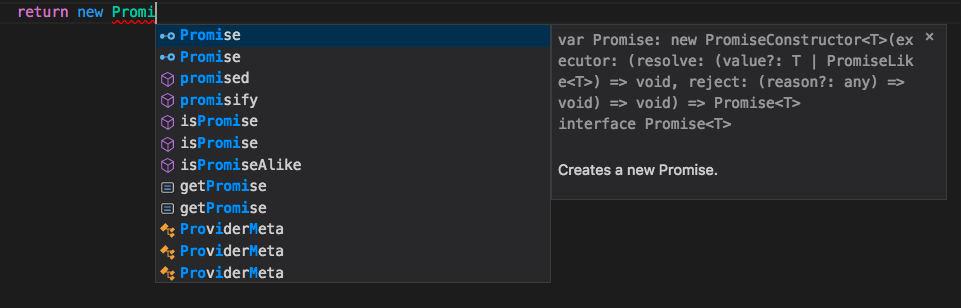
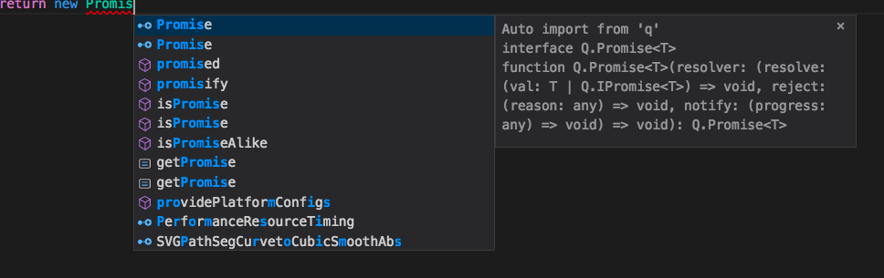

Back in October VSCode, a great product btw, had a release 1.18 that included [auto import statements for JS and TS](https://code.visualstudio.com/updates/v1_18#_auto-import-for-javascript-and-typescript).  This sounds awesome!  I mean I haven't seen it in action yet but still...

## The Setup

I was working in an Ionic Framework project the other day when I first saw this in action.  While Typing you can see the definition that TypeScript is assuming your word is.

#### `Promise` Example

And if you hit tab it auto completes and add any imports that are required to the top of the page. <insert magical fanfare here>

## The Catch

Here's the thing it auto imports when you hit tab, the suggested keywords order doesn't necessarily stay in... well... order.  So I typed out the word `Promise` then backspaced a bit and typed it again and hit tab.

#### Wrong `Promise`

But now the top and selected `Promise` is from the `q` library.  Hitting tab now auto imports `Promise` from `q` and when you try to use `Promise` like the JavaScript/TypeScript `Promise` you get the following error: `'Only a void function can be called with the 'new' keyword.'`

#### Full Error

file: 'file:///Users/brett/Documents/test/src/providers/test/test.ts'
severity: 'Error'
message: 'Only a void function can be called with the 'new' keyword.'
at: '10,16'
source: 'ts'
code: '2350'

Now Googling/Binging/DuckDuckGoing didn't help much since... the message didn't really describe what had happened and acording to [MDN](https://developer.mozilla.org/en-US/docs/Web/JavaScript/Reference/Global_Objects/Promise), and the other times I have used a `Promise` I didn't do anything incorrect.

Of course, I didn't notice the new import at the top of the file since it was off screen so there was that little detail about not using the same `Promise` I thought I was.

#### Full Bad Example

import { Promise } from "q";

export class Test {

    constructor() { }

    testThingy() {

        return new Promise(r => r())
    }

}

## Moral of the Story

Check your `import`s from time to time if you are not managing them explicitly.

 

Now how do I turn that off...

Just kidding... it's right here

#### Disable Auto Imports

Auto imports requires TypeScript 2.6+. You can disable auto imports by setting "typescript.autoImportSuggestions.enabled": false.

## Conclusion

Don’t forget to sign up for [**The Weekly Stand-Up!**](https://wipdeveloper.wpcomstaging.com/newsletter/) to receive free the [WIP Developer.com](https://wipdeveloper.wpcomstaging.com/) weekly newsletter every Sunday!
