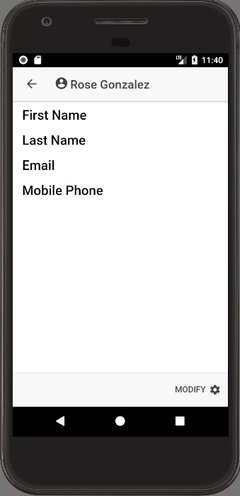
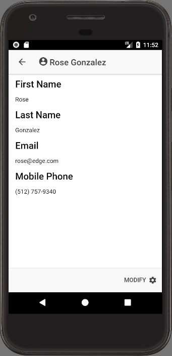

Since we have an understanding of how to [create and run](https://wipdeveloper.wpcomstaging.com/2018/01/10/salesforce-mobile-sdk-ionic-offline-smartstore-query-exact/) a `buildExactQuerySpec` let's put it to use in our contacts app.

## Override `getContact`

We have talked a bit about [TypeScript](https://wipdeveloper.wpcomstaging.com/2018/01/15/salesforce-mobile-sdk-ionic-typescript-inheritance/) [Inheritance](https://wipdeveloper.wpcomstaging.com/2018/01/22/salesforce-mobile-sdk-ionic-typescript-inheritance-part-ii/) and how our `SmartstoreServiceProvider` extends the `ContactsServiceProvider` so we could use the method that we already defined in the `ContactsServiceProvider` without implementing them and make the `SmartstoreServiceProvider` able to be used in place of the `ContactsServiceProvider`.

Now we will need to override the `getContact` method in the `SmartstoreServiceProvider` so that it can make the query for a contact from the SmartStore Soup.

To override the inherited implementation of `getContact` we will redeclare it.  It will accept one parameter named `id` of type `String`.  Most of the body of the method will be the same as our `exactQuery` method so I wont cover it too much.  The main differences will be that we use the `id` that is passed in and instead of calling `promise.then` we will return the `promise`.

#### New `getContact`

getContact(id: string) {
    console.log("SmartstoreServiceProvider.getContact");

    let promise: Promise<{ records: any\[\] }> = new Promise(
      (resolve, reject) => {
        var querySpec = (navigator as sdkNavigator).smartstore.buildExactQuerySpec(
          "Id",
          id
        );

        let success = results => {
          console.log(results);

          resolve({ records: results.currentPageOrderedEntries });
        };

        (navigator as sdkNavigator).smartstore.querySoup(
          this.soupName,
          querySpec,
          success,
          reject
        );
      }
    );

    return promise;
  }

This looks like it should allow us to get our contact details from our Soup but... there's one little issue.

#### No Data

When we [filled our Soup with data](https://wipdeveloper.wpcomstaging.com/2017/12/13/salesforce-mobile-sdk-and-ionic-offline-smartstore-saving-data/) we used a method that only populated the full `Name` and `Id` of the user.

## Quick Fix

To fix our little display issue let's update the `loadContacts` method on the `ContactsServiceProvider`.   We will add the `FirstName`, `LastName`, `Email`, and `MobilePhone` to the `SELECT` statement for our query when we fill the Soup.

#### Updated `ContactsServiceProvider.loadContacts` Method

loadContacts() {
  let oauth = OAuth.createInstance();

  return oauth.login().then(oauthResult => {
    let service = DataService.createInstance(oauthResult);

    return service.query(
      "SELECT Id, FirstName, LastName, Name, Email, MobilePhone FROM Contact LIMIT 50"
    );
  });
}

Now if we rebuild and re-run it things should look a bit different.

#### YAY! Data!

## Conclusion

Don’t forget to sign up for [**The Weekly Stand-Up!**](https://wipdeveloper.wpcomstaging.com/newsletter/) to receive free the [WIP Developer.com](https://wipdeveloper.wpcomstaging.com/) weekly newsletter every Sunday!
