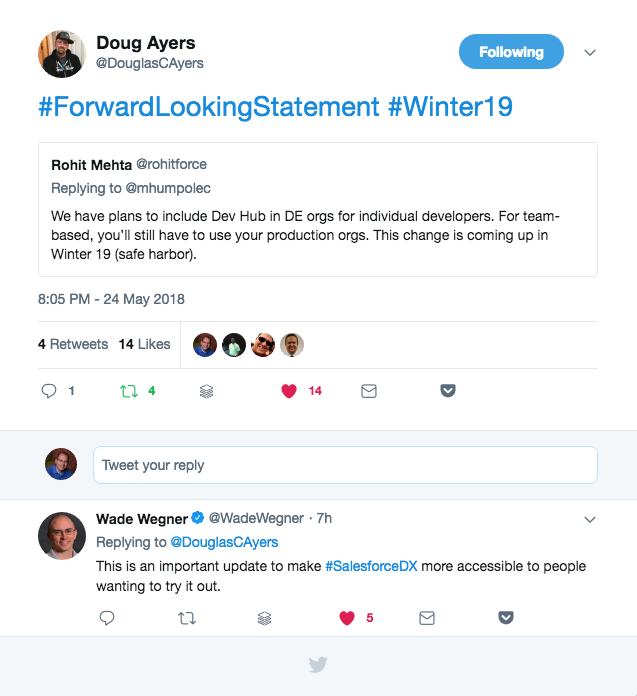

And now for somethings to read (or watch) over the weekend, if you have some spare time that is.

## [Rohit Mehta's Tweet about Dev Hub in DE Orgs](https://twitter.com/DouglasCAyers/status/999818740639379458)

 

## [174: Pour Fast](http://www.gooddaysirpodcast.com/podcast/2018/5/23/174-pour-fast)

Good Day, Sir! Show - Salesforce Podcast – / John De Santiago – May 23 – In this episode we discuss, Bulma and Spring Boot, the cost of insurance and being independent, how little we know of GDPR, nested lightning component initialization, and debate the impact of AI in the near term.

## [Month of Testing: Apex Testing in Depth (Part 2 of 3) - Salesforce Developers Blog](https://developer.salesforce.com/blogs/2018/05/month-of-testing-apex-testing-in-depth-part-2-of-3.html)

Salesforce Developers Blog – May 23, 3:27 AM – This is the second part of a three-part blog series about testing. We will be talking about: Why We Test Apex Testing in Depth Advanced Topics in Salesforce Unit Testing In our last installment, we talked about why we test. Today, we'll talk about…

## [HUMBLE BOOK BUNDLE: WEB DESIGN & DEVELOPMENT BY O'REILLY](https://www.humblebundle.com/books/web-design-development-books?partner=wipdeveloper)

Untangle web design and development with this ebook bundle from O'Reilly Media! Snare titles like React Native Cookbook, CSS: The Definitive Guide, High Performance Images, and more. Then go forth and weave something awesome.

## [15 ways to improve performance of Lightning Components in Salesforce](http://www.jitendrazaa.com/blog/salesforce/15-ways-to-improve-performance-of-lightning-components-in-salesforce/)

JitendraZaa – Jitendra Zaa – May 12, 10:35 AM – Most obvious idea to improve Lightning Component Performance is to avoid server trips. Let's say, you need to know the queue Id to be assigned as owner in Case and also need custom setting information to derive the behavior of Lightning Component.

## [Advanced Components: Introduction](https://www.vuemastery.com/courses/advanced-components/the-introduction/)

Vue Mastery – Adam Jahr – In my Advanced Components course it is my goal to help you get better at using the full functionality of Vue, debugging your applications, extending Vue functionality, and perhaps even contributing to the Vue project itself. In the first few…

## Till Next Week

Want to share something? Let me know by leaving a comment below or emailing [brett@wipdeveloper.com](mailto:brett@wipdeveloper.com)  or following and tell me on [Twitter/BrettMN](https://twitter.com/BrettMN).

Don’t forget to sign up for **[The Weekly Stand-Up!](https://wipdeveloper.wpcomstaging.com/newsletter/)** to receive free the [WIP Developer.com](https://wipdeveloper.wpcomstaging.com/) weekly newsletter every Sunday!
