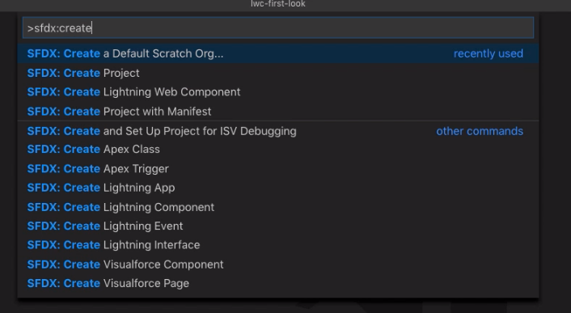
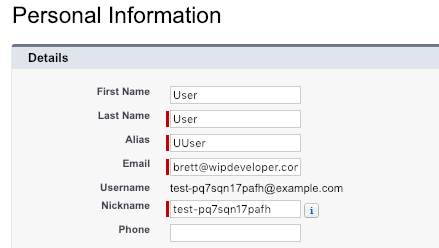

https://youtu.be/U\_sb9IVCd8o

Hello, this is Brett with WIPDeveloper.com. Since we created our SFDX project last time we will need to create a Scratch Org to push out Lighting Web Components to so that we can see them in action.

## Create a Scratch Org

With Visual Studio Code open to our SFDX project open the command palette by pressing `cmd+shift+p` on Mac, or `ctrl+shift+p` on Windows. We will be using the SFDX command Create Default Scratch Org to bring this up you can type `sfdx: create default scratch org`, before you finish typing though it will probably be listed as the top option in the autocomplete list that drops down.

#### Command Palette Autocomplete In Action



You can either select `SFDX: Create a Default Scratch Org...` with the mouse or press enter with it highlighted to begin creating your scratch org.

The first thing you will have to select if the Scratch org definition file. Since we are using the project that was created last time we only have one definition file, `project-scratch-def.json`, so let's choose that for now.

Next we will be prompted to provide an alias to use for the scratch org. It will suggest the name of the project and I see no reason to change it at this point so mine will be aliased as `lwcfirstlook`.

Finally it will ask for the number of days to keep the scratch org before expiring it. The default suggestion is 7 days and I will use that for now.

After a short wait we should see a success message, hopefully it will look something like this:

#### Success Message

```
Starting SFDX: Create a Default Scratch Org...

14:00:45.924 sfdx force:org:create -f config/project-scratch-def.json --setalias lwcfirstlook --durationdays 7 --setdefaultusername
Successfully created scratch org: 00D9A000000911BUAQ, username: test-pq7sqn17pafh@example.com
14:01:03.784 sfdx force:org:create -f config/project-scratch-def.json --setalias lwcfirstlook --durationdays 7 --setdefaultusername ended with exit code 0
```

You can see it has the ID of the org and the username.

Now you can open up your scratch org with `SFDX: Open Default Org` from VSCode. If you want to verify that it is the correct org feel free to look in your user settings to match the username with what the success message provided.

#### Username in Settings



Now that we have a scratch org we can make a Lighting Web Component and see how it looks in a real Salesforce Org.

## That’s it for now.

Remember to sign up for **[The Weekly Stand-Up!](https://wipdeveloper.wpcomstaging.com/newsletter/)**  and you can get updated with any new information we have on WIPDeveloper.com.
