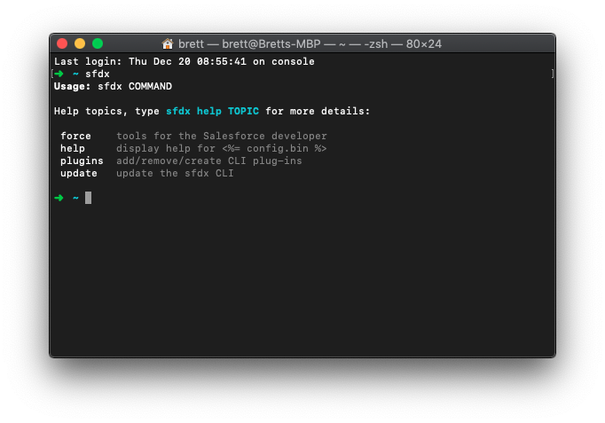
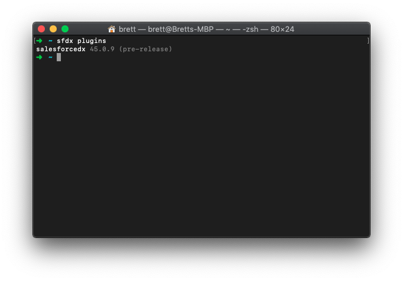
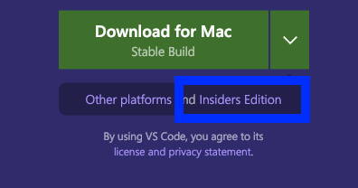
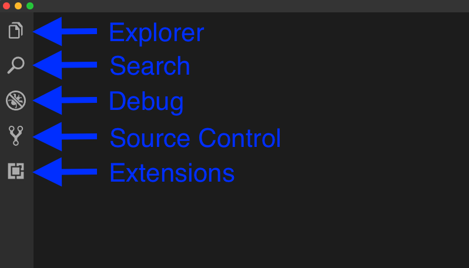
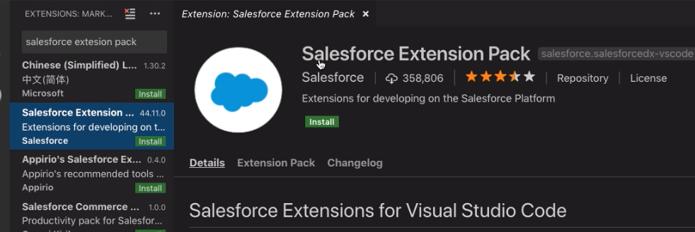

https://youtu.be/xkm-UDnYH1U

## Install SFDX CLI

To get the Salesforce DX command line interface (CLI) tools installed we ca use the links in the [Set Up Your Salesforce DX Environment](https://trailhead.salesforce.com/content/learn/projects/quick-start-lightning-web-components/set-up-salesforce-dx#-----------------install-the-pre-release-version-of-salesforce-command-line-interface-cli------). In the section titled "Install Pre-Release Version of the Command Line Interface (CLI) are links to download for various OSes. Download the one for your Operating System and either wait for the redirect to download or click Continue.

> I would include the links directly but they might get updated and feel it's better to reference where the links are kept.

Once it downloads Start the installer and step through the process. I used the default install location.

> If you already had SFDX installed on you computer you could have probably skipped to this next part.

## Install Salesforce Pre-Release Plugin

In the terminal verify you have `sfdx` installed. You can do this by typing `sfdx` and it will display a help menu

#### `sfdx` Help Menu

`sfdx` Help Menu

Once we have verified that the Salesforce DX CLI is install we will run `sfdx plugins:install salesforcedx@pre-release`. After it runs we can verify the install by typing `sfdx plugins` and making sure our version number is greater than `45.0.9`.

#### `sfdx plugins` Results

## Installing Visual Studio Code

We will get the install for Visual Studio Code (VS Code) from [code.visualstudio.com](https://code.visualstudio.com). I will be using the Insiders edition. The link for it can be found under the Download button.

#### VS Code Insiders Edition Link Location

I like using the Insiders Edition since it allows access to new features months before they are available in the general release. There has only been one time where I remember an issue and it was resolved within a couple hours, maybe less I forget exactly.

Since I'm on a Mac the download is a Zip file. I extract the program and drag it to my Applications folder and can now use VS code from my Launch Pad or Spotlight Search.

> On Windows I believe it requires running an installer but if you are using Windows you are probably used to that sort of thing.

Let's open up VS Code and install the Salesforce Extensions

## Installing Saleforce Extensions in VS Code

With VS Code open we can see the different menu tabs on the left hand side. From top to bottom they are Explorer, Search, Debug, Source Control, and Extensions

#### VS Code Left Hand Menu Tabs

Let's open the Extensions Tab and enter `salesforce extension pack` in the search box. It should look like this.

#### Salesforce Extension Pack

Press the little green install button and wait for it to change to saying Reload. What the Salesforce Extension Pack does in install a collection of extensions created by Salesforce into VS Code. This will enable us to properly see things like Apex, Aura and Visualforce code highlighting. It also include an integration with the SFDX CLI tools we installed earlier and some Apex Debugging extensions.

Once you reload VS Code we can install the last extension.

## Installing LWC Preview Extension

In the search box enter `lightning Web Components` The results should look somewhat like this.

#### Lightning Web Components Extension (Preview)

Press the green Install button again, wait for it to say Reload again. Once it reloads we should be ready to start working with LWC after we get a pre-release org.

## Links

[Code](https://code.visualstudio.com)

[Set Up Your Salesforce DX Environment](https://trailhead.salesforce.com/content/learn/projects/quick-start-lightning-web-components/set-up-salesforce-dx#-----------------install-the-pre-release-version-of-salesforce-command-line-interface-cli------)

## That’s it for now.

Remember to sign up for **[The Weekly Stand-Up!](https://wipdeveloper.wpcomstaging.com/newsletter/)**  and you can get updated with any new information we have on WIPDeveloper.com.
