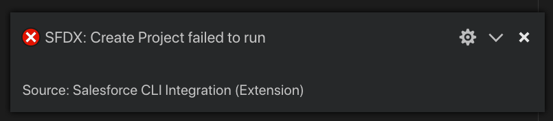

https://youtu.be/WFJh-ghq5SE

Hello, this is Brett with WIPDeveloper.com.  I ran into this issue when trying to use the Salesforce DX Create a Project command. 

## **O**n the Command Line

Using the command line `sfdx force:project:create` giving it the name `test`. This causes the error `A name parameter is required to create a storage`.  This is weird since I am creating a project it would be doing all that for me.

#### Command with Error Message

sfdx force:project:create -n test ▸    ERR\_ASSERTION: A name parameter is required to create a storage

This also happens when using the SFDX extensions inside Visual Studio Code.

## With the Extension

Inside Visual Studio Code open the command Palette with `cmd+p` or `ctrl+p` and typing `SFDX: Create Project` then it will ask for a name, I used `test2`, then you browse to the folder to create the project.

#### VS Code Error Notice

#### Output Error Message

Starting SFDX: Create Project  
  
22:34:46.721 sfdx force:project:create --projectname test3 --outputdir /Users/brett/Documents/Just Some Apps/internal/blog  
 ▸    ERR\_ASSERTION: A name parameter is required to create a storage  
22:34:48.591 sfdx force:project:create --projectname test3 --outputdir /Users/brett/Documents/Just Some Apps/internal/blog ended with exit code 1

## Workaround

To get past this error I created a \`package.json\` with a \`name\` property in the folder where I am running the command or have Visual Studio Code opened. I had found some other people on the internet get this error with their node application, not Salesforce related, thought I would try this as a workaround.

#### Terminal Results

➜  blog sfdx force:project:create -n test  
target dir = /Users/brett/Documents/Just Some Apps/internal/blog  
   create test/sfdx-project.json  
   create test/README.md  
   create test/.forceignore  
   create test/config/project-scratch-def.json

Using the extension it closes your current VS Code and opens the folder that was created.  

##  **Recap**

To get rid of the `ERR_ASSERTION: A name parameter is required to create a storage` error I created a `package.json` with a `name` property in the directory I was executing the command or had opened Visual Studio Code in. Hope that helps.

## That’s it for now.

Remember to sign up for [**The Weekly Stand-Up!**](https://wipdeveloper.wpcomstaging.com/newsletter/)  and you can get updated with any new information we have on WIPDeveloper.com.
