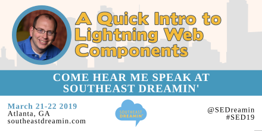

Hello! In March the Southeast Dreamin' 19 event will be taking place in Atlanta Georgia March 21- 22, 2019. I will be presenting "A Quick Intro to Lightning Web Components".

## Southeast Dreamin'

For more information about [Southeast Dreamin'](http://www.southeastdreamin.com/) and to [register](http://www.southeastdreamin.com/#tile_registration) you should visit their [site](http://www.southeastdreamin.com/). Bellow is a copy from the [About Us](http://www.southeastdreamin.com/about-us-2/) page **What is Southeast Dreamin’?** section.

> _Southeast Dreamin’ was created by Salesforce users for Salesforce users, to provide learning and networking opportunities as well as facilitate collaboration._  
> _It is a one & a half day event that features a Keynote speaker, over 20 community-led breakout sessions and Hands on Training (HOT) sessions. You will also have access to a Sponsor Expo and live Demo Jam to learn about AppExchange options that can expand your use of Salesforce._

## A Quick Intro to Lightning Web Components

They made a neat banner image!

_Lighting Web Components are the new, standards based way to create UI elements for Lighting. We will take a quick look at the tools needed to get started and the basics of creating a Lighting Web Component._

Hope to see you there!

## That’s it for now.

Remember to sign up for **[The Weekly Stand-Up!](https://wipdeveloper.wpcomstaging.com/newsletter/)**  and you can get updated with any new information we have on WIPDeveloper.com.
