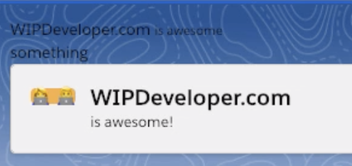
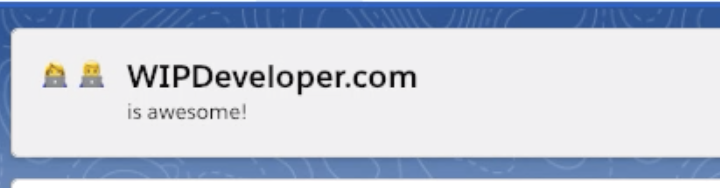

* * *

Hello, this is Brett with WIPDeveloper.com. Last time we created a simple Lighting Web Component and deployed it to a Scratch Org. It was pretty simple looking with the plain text that allowed the background image to show through so it was difficult to see. Let's add some styling to it using the [Salesforce Lightning Design System](https://www.lightningdesignsystem.com/).

## Picking Some Style

The [Salesforce Lightning Design System](https://www.lightningdesignsystem.com/) (SLDS) documentation is available at [lightningdesignsystem.com](https://www.lightningdesignsystem.com/). We don't need to download anything from there as all the styles should be available in our Lighting Web Component as long as we are using it in the Salesforce Lightning Experience or the Salesforce Mobile app.

Since our `firstComponent` resembles a page header let's get the code sample from the SLDS [Page Base Header](https://www.lightningdesignsystem.com/components/page-headers/). I'm going to include it bellow so I have a reference here.

#### SLDS Base Page Header

```
<div class="slds-page-header">
  <div class="slds-page-header__row">
    <div class="slds-page-header__col-title">
      <div class="slds-media">
        <div class="slds-media__figure">
          <span
            class="slds-icon_container slds-icon-standard-opportunity"
            title="opportunity"
          >
            <svg class="slds-icon slds-page-header__icon" aria-hidden="true">
              <use
                xmlns:xlink="http://www.w3.org/1999/xlink"
                xlink:href="/assets/icons/standard-sprite/svg/symbols.svg#opportunity"
              />
            </svg>
            <span class="slds-assistive-text">opportunity</span>
          </span>
        </div>
        <div class="slds-media__body">
          <div class="slds-page-header__name">
            <div class="slds-page-header__name-title">
              <h1>
                <span
                  class="slds-page-header__title slds-truncate"
                  title="Rohde Corp - 80,000 Widgets"
                  >Rohde Corp - 80,000 Widgets</span
                >
              </h1>
            </div>
          </div>
          <p class="slds-page-header__name-meta">
            Mark Jaeckal • Unlimited Customer • 11/13/15
          </p>
        </div>
      </div>
    </div>
  </div>
</div>
```

We can paste this into our component. Visual Studio Code will have issues with the SVG's `<use>` tag not having a closing element but we will be replacing that with 2 EMOJI's so let's delete the SVG, and children, element and replace it with the Female Technologist and Male Technologist `👩‍💻 👨‍💻`.

Before we deploy it I am going to change the existing text to what I would like it to say, namely that WIPDeveloper.com is awesome! and remove the previous markup. The completed markup should like similar to this.

#### Update Page Header in `firstComponent` HTML

```
<template>
  <div class="slds-page-header">
    <div class="slds-page-header__row">
      <div class="slds-page-header__col-title">
        <div class="slds-media">
          <div class="slds-media__figure">
            <span class="slds-icon_container slds-icon-standard-opportunity" title="WIPDeveloper.com">
              👩‍💻 👨‍💻<span class="slds-assistive-text">WIPDeveloper.com</span>
            </span>
          </div>
          <div class="slds-media__body">
            <div class="slds-page-header__name">
              <div class="slds-page-header__name-title">
                <h1>
                  <span
                    class="slds-page-header__title slds-truncate"
                    title="WIPDeveloper.com"
                    >WIPDeveloper.com</span
                  >
                </h1>
              </div>
            </div>
            <p class="slds-page-header__name-meta">is awesome!</p>
          </div>
        </div>
      </div>
    </div>
  </div>
</template>
```

Now let's deploy it and see that all the styles are rendering properly in our page.



`firstCompoent` with SLDS Page Header markup

If you notice the yellow/orange background around the EMOJI it's because I forgot to remove the `slds-icon-standard-opportunity` class from the span that wraps the icons. Remove `slds-icon-standard-opportunity` , redeploy and check again.



`firstComponent` complete!  

That looks good for right now. Next time we should look into using some CSS to get some personal styling going.

## Links

- [Page Headers](https://www.lightningdesignsystem.com/components/page-headers/) - [Salesforce Lightning Design System](https://www.lightningdesignsystem.com/)
- 👩‍💻 [Woman Technologist](https://emojipedia.org/female-technologist/)
- 👨‍💻 [Man Technologist](https://emojipedia.org/male-technologist/)

## That’s it for now.

Remember to sign up for **[The Weekly Stand-Up!](https://wipdeveloper.wpcomstaging.com/newsletter/)**  and you can get updated with any new information we have on WIPDeveloper.com.
