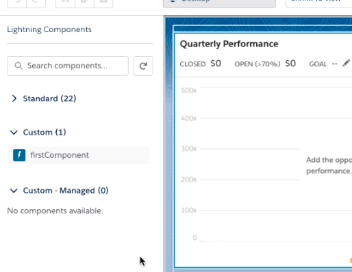
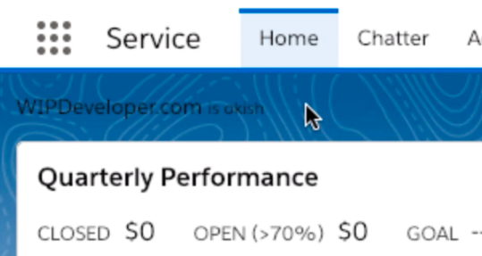
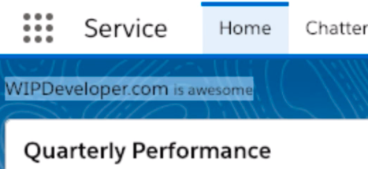

https://youtu.be/ND75PPmOk\_0

Hello, this is Brett with WIPDeveloper.com. With our scratch org ready we can now create a Lighting Web Component and push it to the scratch org to see it in action.

## Create a Lightning Web Component

We will be using the `SFDX: Create Lightning Web Component` command from the command palette.

> Be sure to have Visual Studio Code open in your SFDX project. To open the command palette by pressing `cmd+shift+p` on Mac, or `ctrl+shift+p` on Windows.

The first thing it will ask is what folder to create it in. I'll use the default for now, `force-app/main/default/lwc`.


Default Lightning Web Component Location

Since this is the first LWC we are creating I'm going to name it `firstComponent` in the second dialog box.


Naming our LWC

With the name filled in and after you press enter the SFDX extensions will create our component in a folder that has the same name as our component. In my case that means the folder for my component is located at `force-app/main/default/lwc/firstComponent`.

In the `firstComponent` folder you should have 3 files:

1. `firstComponent.html` - this contains the html template for our component
2. `firstComponent.js` - this contains the JavaScript class for our component
3. `firstComponent.js-meta.xml` - this is the xml meta data file for our component

In `firstComponent.html` I'm going to add an `h1` tag for now so it should look something like this.

```
<template>
    <h1>WIPDeveloper.com <small>is okish</small></h1>
</template>
```

Now we will want to push this to the scratch org with the `SFDX: Push Source to Default Scratch Org`. Once it run successfully we could see if this loaded in our scratch org but since we didn't update the `firstComponent.js-meta.xml` we wont be able to use it any where. Let's add some targets to the `firstComponent.js-meta.xml` and set `isExposed` to `true`.

#### Update to `firstComponent.js-meta.xml`

```
<?xml version="1.0" encoding="UTF-8"?>
<LightningComponentBundle xmlns="http://soap.sforce.com/2006/04/metadata" fqn="firstComponent">
    <apiVersion>45.0</apiVersion>
  <isExposed>true</isExposed>
  <targets>
    <target>lightning__AppPage</target>
    <target>lightning__RecordPage</target>
    <target>lightning__HomePage</target>
  </targets>
</LightningComponentBundle>
```

Now push it again and it should be available when we customize an App page, Record page, or the Home page.



`firstComponent` listed as a Custom Component

Drag it onto a page layout, save it, and activate it to see it in full static action after we refresh a few times.



Our `firstComponent` in use

Now if we want to change `firstComponent` all we need to do it update the html to something like the following then we can save and push it to the scratch org.

### Updated HTML

```
<template>
    <h1>WIPDeveloper.com <small>is awesome</small></h1>
</template>
```

To see this updated code we will just need to refresh the and see the change.



Updated `firstComponent`

Of course this isn't the most pretty component in the world so we will take a look at styling it next time.

## That’s it for now.

Remember to sign up for **[The Weekly Stand-Up!](https://wipdeveloper.wpcomstaging.com/newsletter/)**  and you can get updated with any new information we have on WIPDeveloper.com.
